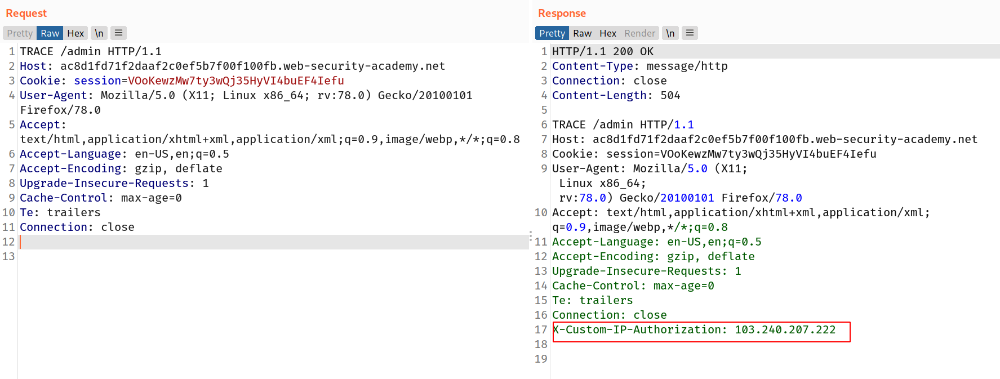
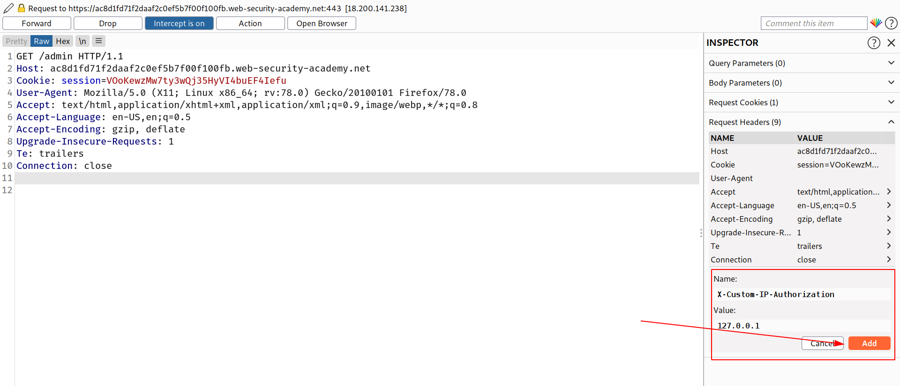

### Information disclosure due to insecure configuration

Websites are sometimes vulnerable as a result of improper configuration. This is especially common due to the widespread use of third-party technologies, whose vast array of configuration options are not necessarily well-understood by those implementing them.

In other cases, developers might forget to disable various debugging options in the production environment. For example, the HTTP `TRACE` method is designed for diagnostic purposes. If enabled, the web server will respond to requests that use the `TRACE` method by echoing in the response the exact request that was received. This behavior is often harmless, but occasionally leads to information disclosure, such as the name of internal authentication headers that may be appended to requests by reverse proxies.

## Challenge

> This lab's administration interface has an authentication bypass vulnerability, but it is impractical to exploit without knowledge of a custom HTTP header used by the front-end.
> To solve the lab, obtain the header name then use it to bypass the lab's authentication. Access the admin interface and delete Carlos's account.
> You can log in to your own account using the following credentials: `wiener:peter`

--> I ran gobuster on it to find the hidden directories and found one directory called `/admin` in which i found this !

```
Admin interface only available to local users
```

--> I tried `TRACE` method on /admin and i found this respose in which i found this header

```
X-Custom-IP-Authorization
```



--> So this page says it's only available to local users so i added this header in `GET` request on `/admin` and i found the admin panel.

```
X-Custom-IP-Authorization : 127.0.0.1
```



--> Then you will see 2 users here , i have deleted `carlos` already that's why you are seeing only one account but in your case you will see 2 accounts.

Click `delete` and intercept it also!

And there also you have to add the header `X-Custom-IP-Authorization:127.0.0.1`

And you deleted the acoount !
