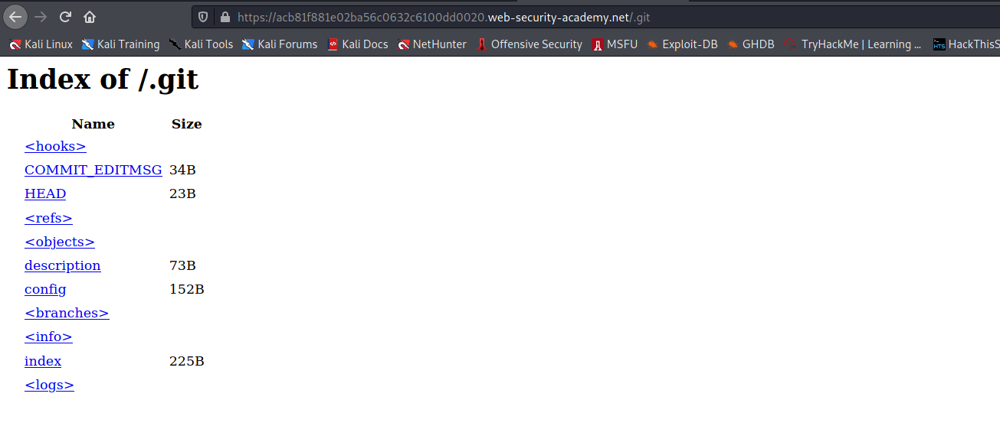
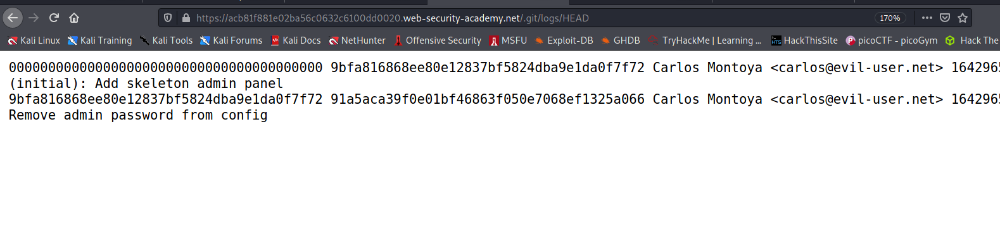
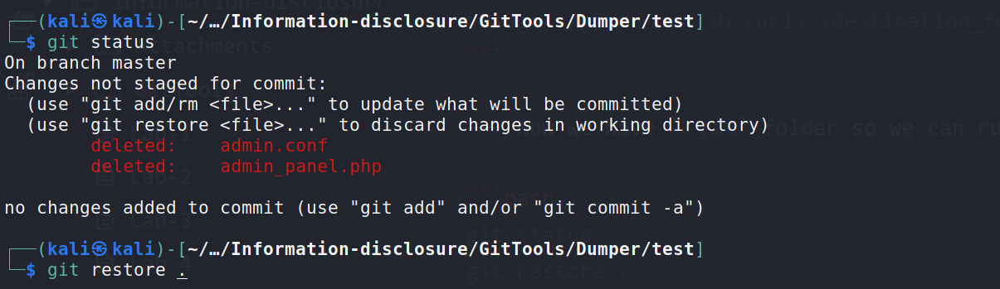
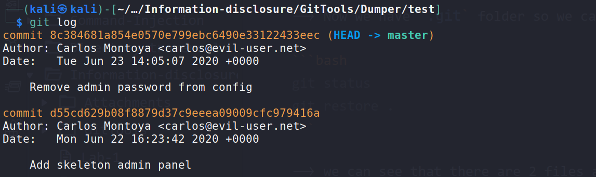
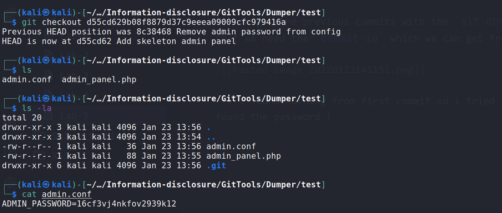

### Version control history

Virtually all websites are developed using some form of version control system, such as Git. By default, a Git project stores all of its version control data in a folder called `.git`. Occasionally, websites expose this directory in the production environment. In this case, you might be able to access it by simply browsing to `/.git`.

While it is often impractical to manually browse the raw file structure and contents, there are various methods for downloading the entire `.git` directory. You can then open it using your local installation of Git to gain access to the website's version control history. This may include logs containing committed changes and other interesting information.

This might not give you access to the full source code, but comparing the diff will allow you to read small snippets of code. As with any source code, you might also find sensitive data hard-coded within some of the changed lines.

## Challenge

> This lab discloses sensitive information via its version control history. To solve the lab, obtain the password for the `administrator` user then log in and delete Carlos's account.

--> I Found this in `.git` directory of website



Then i enumrated these folders and found this in `logs`:



So i searched for how to get previous commits from `.git` folder and i found [this](https://github.com/internetwache/GitTools) tool in which we can dump all the folders at one time !

```bash
git clone https://github.com/internetwache/GitTools.git
cd Dumper
./gitdumper.sh https://acc31fc91fffc025c0222ac6001e0060.web-security-academy.net/.git/ test
#Usage ./gitdumper.sh <url> <destination_folder>
```

--> Now we have `.git` folder so we can run git commands on it !

```bash
git status
git restore .
```

--> we can see that there are 2 files are modified !



--> After that i done `git log` to find the commit-id for commits and i found 2 commits

we can get the previous commits with the `git checkout` commands but for that we need the `commit-id` which we can get from `git log`



--> I found nothing from first commit so i tried with second commit and found the password !


