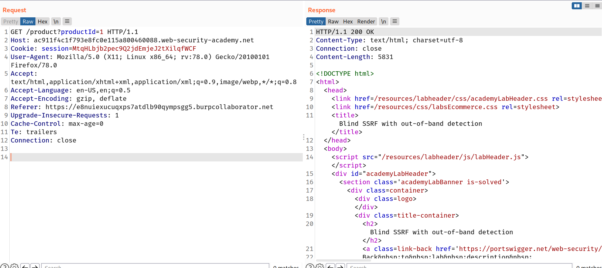
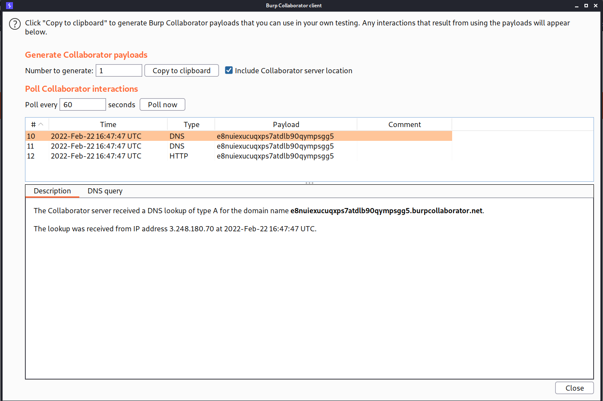

## What is blind SSRF?

Blind SSRF vulnerabilities arise when an application can be induced to issue a back-end HTTP request to a supplied URL, but the response from the back-end request is not returned in the application's front-end response.

## What is the impact of blind SSRF vulnerabilities?

The impact of blind SSRF vulnerabilities is often lower than fully informed SSRF vulnerabilities because of their one-way nature. They cannot be trivially exploited to retrieve sensitive data from back-end systems, although in some situations they can be exploited to achieve full remote code execution.

## How to find and exploit blind SSRF vulnerabilities

The most reliable way to detect blind SSRF vulnerabilities is using out-of-band ([OAST](https://portswigger.net/burp/application-security-testing/oast)) techniques. This involves attempting to trigger an HTTP request to an external system that you control, and monitoring for network interactions with that system.

The easiest and most effective way to use out-of-band techniques is using [Burp Collaborator](https://portswigger.net/burp/documentation/collaborator). You can use the [Burp Collaborator client](https://portswigger.net/burp/documentation/desktop/tools/collaborator-client) to generate unique domain names, send these in payloads to the application, and monitor for any interaction with those domains. If an incoming HTTP request is observed coming from the application, then it is vulnerable to SSRF.

> It is common when testing for SSRF vulnerabilities to observe a DNS look-up for the supplied Collaborator domain, but no subsequent HTTP request. This typically happens because the application attempted to make an HTTP request to the domain, which caused the initial DNS lookup, but the actual HTTP request was blocked by network-level filtering. It is relatively common for infrastructure to allow outbound DNS traffic, since this is needed for so many purposes, but block HTTP connections to unexpected destinations.

## Challenge

--> In this lab we have to do DNS lookup with burp collaborator in `referrer` header while fetching the product.

So i intercepted the product request and changed the `referrer` header with my burp collaborator's server link.

Example link:

```
https://e8nuiexucuqxps7atdlb90qympsgg5.burpcollaborator.net
```



--> And after that click `poll now` and you will get DNS lookup perfromed on your domain!



And we solved the lab!
