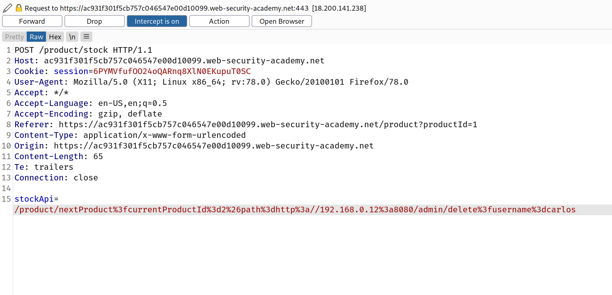

## Bypassing SSRF filters via open redirection

It is sometimes possible to circumvent any kind of filter-based defenses by exploiting an open redirection vulnerability.

In the preceding SSRF example, suppose the user-submitted URL is strictly validated to prevent malicious exploitation of the SSRF behavior. However, the application whose URLs are allowed contains an open redirection vulnerability. Provided the API used to make the back-end HTTP request supports redirections, you can construct a URL that satisfies the filter and results in a redirected request to the desired back-end target.

For example, suppose the application contains an open redirection vulnerability in which the following URL:

`/product/nextProduct?currentProductId=6&path=http://evil-user.net`

returns a redirection to:

`http://evil-user.net`

You can leverage the open redirection vulnerability to bypass the URL filter, and exploit the SSRF vulnerability as follows:

```
POST /product/stock HTTP/1.0
Content-Type: application/x-www-form-urlencoded Content-Length: 118 stockApi=http://weliketoshop.net/product/nextProduct?currentProductId=6&path=http://192.168.0.68/admin
```

This SSRF exploit works because the application first validates that the supplied `stockAPI` URL is on an allowed domain, which it is. The application then requests the supplied URL, which triggers the open redirection. It follows the redirection, and makes a request to the internal URL of the attacker's choosing.

## Challenge

--> In this challenge we have to find the open redirection vulnerability and escalate it to SSRF

We have ip address given which is `http://192.168.0.12:8080/admin`

--> i was playing with `stockApi` but i was unable to find the open redirect and after some time i decided to see other requests And i found that when we click on `next post` the request looks like this :

```
GET /product/nextProduct?currentProductId=2&path=/product?productId=3
```

Here we have `path` parameter in which i tried to write `https://google.com` and boom i got the open redirect!

--> After that i tried to change it with `http://192.168.0.12:8080/admin` but the page was keep loading so that means it can't find the page!

So after that i tried to put something like this in `stockApi` value and encoded it with url encode.

```
/product/nextProduct?currentProductId=2&path=http://192.168.0.12:8080/admin/delete?username=carlos
```

So final request looks like this:



And we solved the lab!
