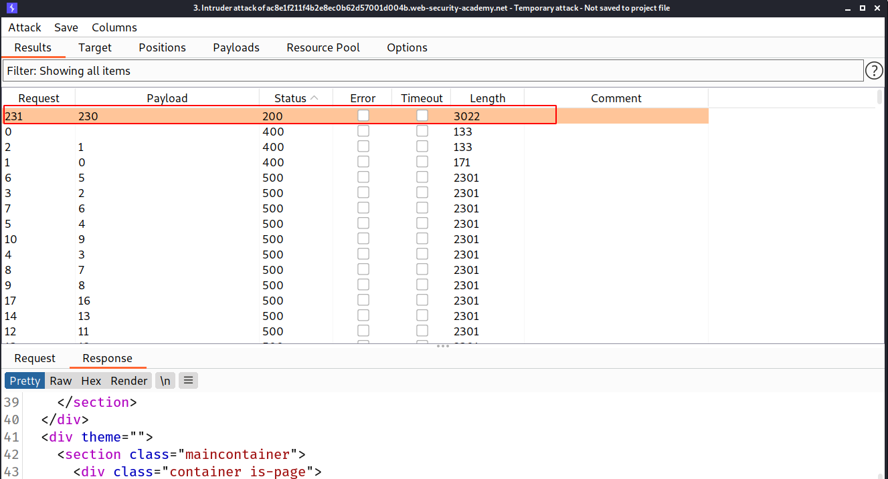
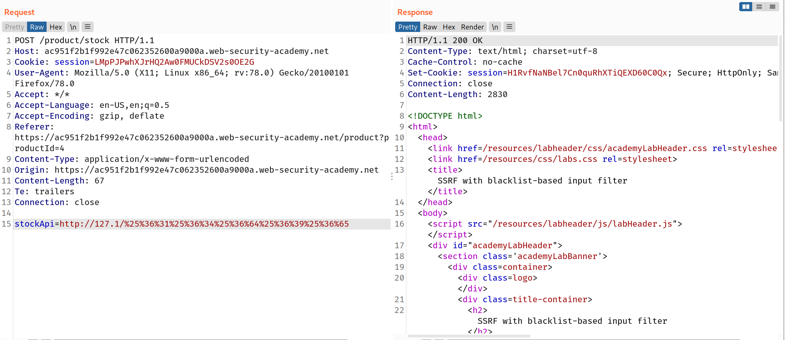

### SSRF attacks against other back-end systems

Another type of trust relationship that often arises with server-side request forgery is where the application server is able to interact with other back-end systems that are not directly reachable by users. These systems often have non-routable private IP addresses. Since the back-end systems are normally protected by the network topology, they often have a weaker security posture. In many cases, internal back-end systems contain sensitive functionality that can be accessed without authentication by anyone who is able to interact with the systems.

In the preceding example, suppose there is an administrative interface at the back-end URL `https://192.168.0.68/admin`. Here, an attacker can exploit the SSRF vulnerability to access the administrative interface by submitting the following request:

```
POST /product/stock HTTP/1.0
Content-Type: application/x-www-form-urlencoded Content-Length: 118 stockApi=http://192.168.0.68/admin
```

## Challenge

--> In this lab, we have to first find the current internal ip on which the backend service is running and after that we have to delete the account of `carlos`

So first i brute forced the `192.168.0.x` to get the ip address and i found it as `192.168.0.230`



--> So now we just have to do as previous challenge.

First change the stockApi value to `http://192.168.0.230:8080/admin` And store it in repeater also

--> Forward this request.

After intercept the delete request and Capture the url for deleting the user and then change it with request in repeater!

And we solved the lab!


