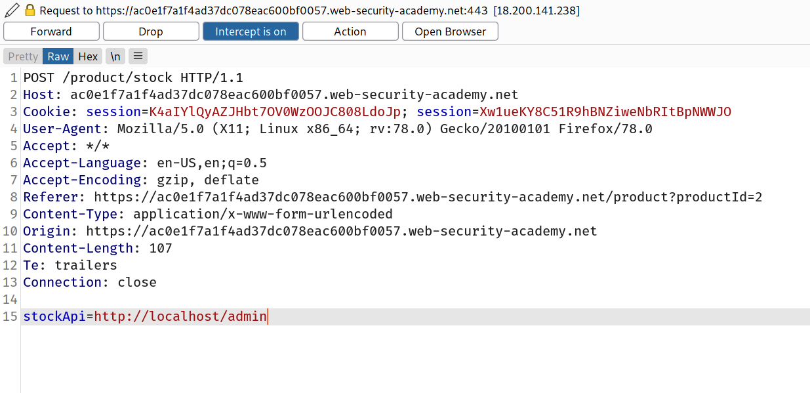
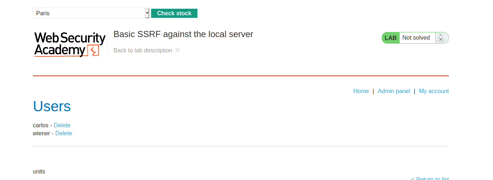
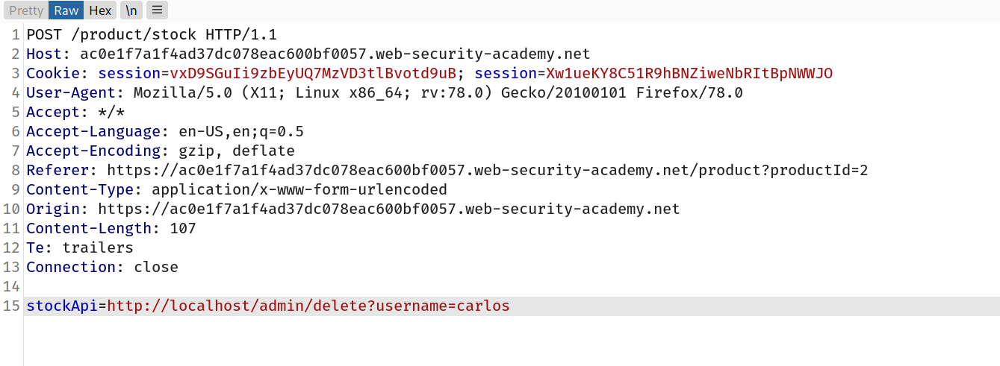

## SSRF attacks against the server itself

In an SSRF attack against the server itself, the attacker induces the application to make an HTTP request back to the server that is hosting the application, via its loopback network interface. This will typically involve supplying a URL with a hostname like `127.0.0.1` (a reserved IP address that points to the loopback adapter) or `localhost` (a commonly used name for the same adapter).

For example, consider a shopping application that lets the user view whether an item is in stock in a particular store. To provide the stock information, the application must query various back-end REST APIs, dependent on the product and store in question. The function is implemented by passing the URL to the relevant back-end API endpoint via a front-end HTTP request. So when a user views the stock status for an item, their browser makes a request like this:

`POST /product/stock HTTP/1.0 Content-Type: application/x-www-form-urlencoded Content-Length: 118 stockApi=http://stock.weliketoshop.net:8080/product/stock/check%3FproductId%3D6%26storeId%3D1`

This causes the server to make a request to the specified URL, retrieve the stock status, and return this to the user.

In this situation, an attacker can modify the request to specify a URL local to the server itself. For example:

```
POST /product/stock HTTP/1.0
Content-Type: application/x-www-form-urlencoded Content-Length: 118 stockApi=http://localhost/admin
```

Here, the server will fetch the contents of the `/admin` URL and return it to the user.

Now of course, the attacker could just visit the `/admin` URL directly. But the administrative functionality is ordinarily accessible only to suitable authenticated users. So an attacker who simply visits the URL directly won't see anything of interest. However, when the request to the `/admin` URL comes from the local machine itself, the normal [access controls](https://portswigger.net/web-security/access-control) are bypassed. The application grants full access to the administrative functionality, because the request appears to originate from a trusted location.

Why do applications behave in this way, and implicitly trust requests that come from the local machine? This can arise for various reasons:

- The [access control](https://portswigger.net/web-security/access-control) check might be implemented in a different component that sits in front of the application server. When a connection is made back to the server itself, the check is bypassed.
- For disaster recovery purposes, the application might allow administrative access without logging in, to any user coming from the local machine. This provides a way for an administrator to recover the system in the event they lose their credentials. The assumption here is that only a fully trusted user would be coming directly from the server itself.
- The administrative interface might be listening on a different port number than the main application, and so might not be reachable directly by users.

These kind of trust relationships, where requests originating from the local machine are handled differently than ordinary requests, is often what makes SSRF into a critical vulnerability.

## Challenge

--> So in this challenge we have to delete the `carlos`'s account by performing SSRF in check stock request.

So i intercepted check stock request and changed the stockApi value to `http://localhost/admin`



--> And i got the admin panel!



But whenever we click on something then i was getting the below error.

```
Admin interface only available if logged in as an administrator, or if requested from loopback
```

So After that i intercepted the user deleting request and added it in stockApi and i solved the lab!


