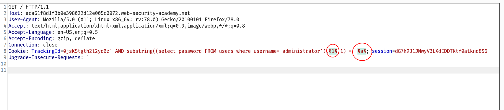
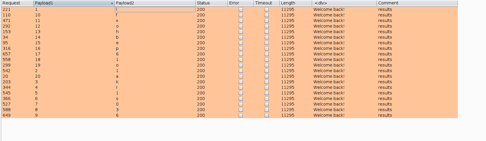
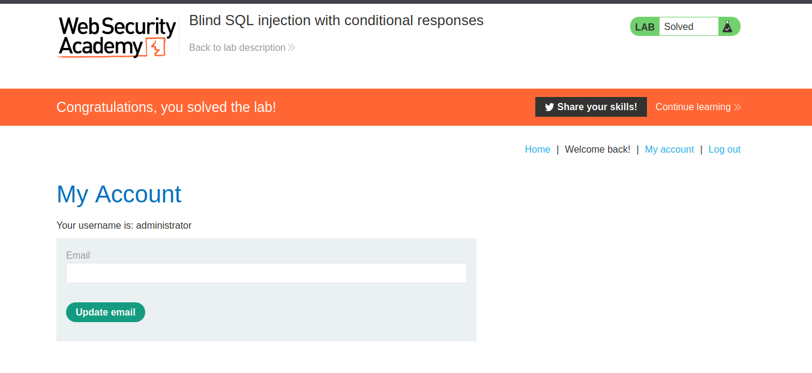

# Blind SQL injection

In this section, we'll describe what blind SQL injection is, explain various techniques for finding and exploiting blind SQL injection vulnerabilities.

## What is blind SQL injection?

Blind SQL injection arises when an application is vulnerable to SQL injection, but its HTTP responses do not contain the results of the relevant SQL query or the details of any database errors.

With blind SQL injection vulnerabilities, many techniques such as [`UNION` attacks](https://portswigger.net/web-security/sql-injection/union-attacks), are not effective because they rely on being able to see the results of the injected query within the application's responses. It is still possible to exploit blind SQL injection to access unauthorized data, but different techniques must be used.

## Exploiting blind SQL injection by triggering conditional responses

Consider an application that uses tracking cookies to gather analytics about usage. Requests to the application include a cookie header like this:

`Cookie: TrackingId=u5YD3PapBcR4lN3e7Tj4`

When a request containing a `TrackingId` cookie is processed, the application determines whether this is a known user using an SQL query like this:

`SELECT TrackingId FROM TrackedUsers WHERE TrackingId = 'u5YD3PapBcR4lN3e7Tj4'`

This query is vulnerable to SQL injection, but the results from the query are not returned to the user. However, the application does behave differently depending on whether the query returns any data. If it returns data (because a recognized `TrackingId` was submitted), then a "Welcome back" message is displayed within the page.

This behavior is enough to be able to exploit the blind SQL injection vulnerability and retrieve information by triggering different responses conditionally, depending on an injected condition. To see how this works, suppose that two requests are sent containing the following `TrackingId` cookie values in turn:

`…xyz' AND '1'='1 …xyz' AND '1'='2`

The first of these values will cause the query to return results, because the injected `AND '1'='1` condition is true, and so the "Welcome back" message will be displayed. Whereas the second value will cause the query to not return any results, because the injected condition is false, and so the "Welcome back" message will not be displayed. This allows us to determine the answer to any single injected condition, and so extract data one bit at a time.

For example, suppose there is a table called `Users` with the columns `Username` and `Password`, and a user called `Administrator`. We can systematically determine the password for this user by sending a series of inputs to test the password one character at a time.

To do this, we start with the following input:

`xyz' AND SUBSTRING((SELECT Password FROM Users WHERE Username = 'Administrator'), 1, 1) > 'm`

This returns the "Welcome back" message, indicating that the injected condition is true, and so the first character of the password is greater than `m`.

Next, we send the following input:

`xyz' AND SUBSTRING((SELECT Password FROM Users WHERE Username = 'Administrator'), 1, 1) > 't`

This does not return the "Welcome back" message, indicating that the injected condition is false, and so the first character of the password is not greater than `t`.

Eventually, we send the following input, which returns the "Welcome back" message, thereby confirming that the first character of the password is `s`:

`xyz' AND SUBSTRING((SELECT Password FROM Users WHERE Username = 'Administrator'), 1, 1) = 's`

We can continue this process to systematically determine the full password for the `Administrator` user.

---

## Challenge :

--> i used this payload and brute forced the characters using `intruder`

`' AND SUBSTRING((SELECT password FROM users WHERE username = 'administrator'), 1, 1) = 's`

--> add this in intruder

--> after some time i got this result

--> after assembling the output i got the correct password !

--> and we solved the lab !
