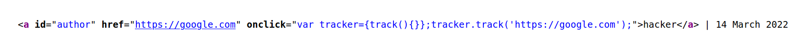
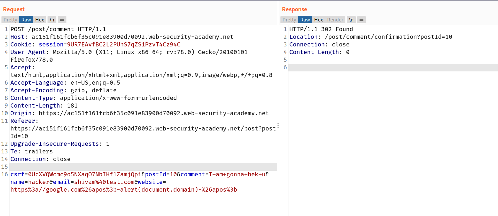
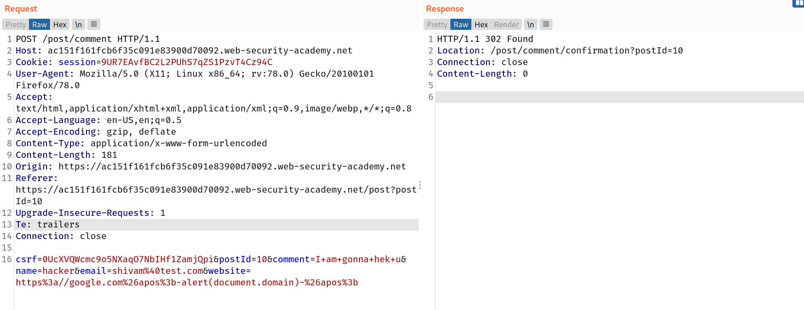

### Making use of HTML-encoding

When the XSS context is some existing JavaScript within a quoted tag attribute, such as an event handler, it is possible to make use of HTML-encoding to work around some input filters.

When the browser has parsed out the HTML tags and attributes within a response, it will perform HTML-decoding of tag attribute values before they are processed any further. If the server-side application blocks or sanitizes certain characters that are needed for a successful XSS exploit, you can often bypass the input validation by HTML-encoding those characters.

For example, if the XSS context is as follows:

`<a href="#" onclick="... var input='controllable data here'; ...">`

and the application blocks or escapes single quote characters, you can use the following payload to break out of the JavaScript string and execute your own script:

`&apos;-alert(document.domain)-&apos;`

The `&apos;` sequence is an HTML entity representing an apostrophe or single quote. Because the browser HTML-decodes the value of the `onclick` attribute before the JavaScript is interpreted, the entities are decoded as quotes, which become string delimiters, and so the attack succeeds.

## Lab: Stored XSS into `onclick` event with angle brackets and double quotes HTML-encoded and single quotes and backslash escaped

> This lab contains a [stored cross-site scripting](https://portswigger.net/web-security/cross-site-scripting/stored) vulnerability in the comment functionality.
> To solve this lab, submit a comment that calls the `alert` function when the comment author name is clicked.

--> So first i tried to comment with normal values and also i added `https://google.com` in website field because it was converting the username into link of their website.

So after posting the comment i found in source code that it was running some js inside `onclick` function to track the commenter's website.



So now we have to break this js and use our own malicious payload to trigger an alert. So i used this payload in which i HTML encoded single quotes as `&apos` and used this payload :

```
https%3a//google.com%26apos%3b-alert(document.domain)-%26apos%3b
```

So final request will look like this :



And we solved the lab!



## XSS in JavaScript template literals

JavaScript template literals are string literals that allow embedded JavaScript expressions. The embedded expressions are evaluated and are normally concatenated into the surrounding text. Template literals are encapsulated in backticks instead of normal quotation marks, and embedded expressions are identified using the `${...}` syntax.

For example, the following script will print a welcome message that includes the user's display name:

`` document.getElementById('message').innerText = `Welcome, ${user.displayName}.`; ``

When the XSS context is into a JavaScript template literal, there is no need to terminate the literal. Instead, you simply need to use the `${...}` syntax to embed a JavaScript expression that will be executed when the literal is processed. For example, if the XSS context is as follows:

`` <script> ... var input = `controllable data here`; ... </script> ``

then you can use the following payload to execute JavaScript without terminating the template literal:

`${alert(document.domain)}`

## Lab: Reflected XSS into a template literal with angle brackets, single, double quotes, backslash and backticks Unicode-escaped

> This lab contains a [reflected cross-site scripting](https://portswigger.net/web-security/cross-site-scripting/reflected) vulnerability in the search blog functionality. The reflection occurs inside a template string with angle brackets, single, and double quotes HTML encoded, and backticks escaped. To solve this lab, perform a cross-site scripting attack that calls the `alert` function inside the template string.

Learn more about template literals [here](https://developer.mozilla.org/en-US/docs/Web/JavaScript/Reference/Template_literals)

So here we just have to use this payload to trigger alert:

```
${alert(document.domain)}
```

We are writing it inside `{}` because in template literals, anything inside `{}` will be executed as javascript code.

And we solved the lab!
