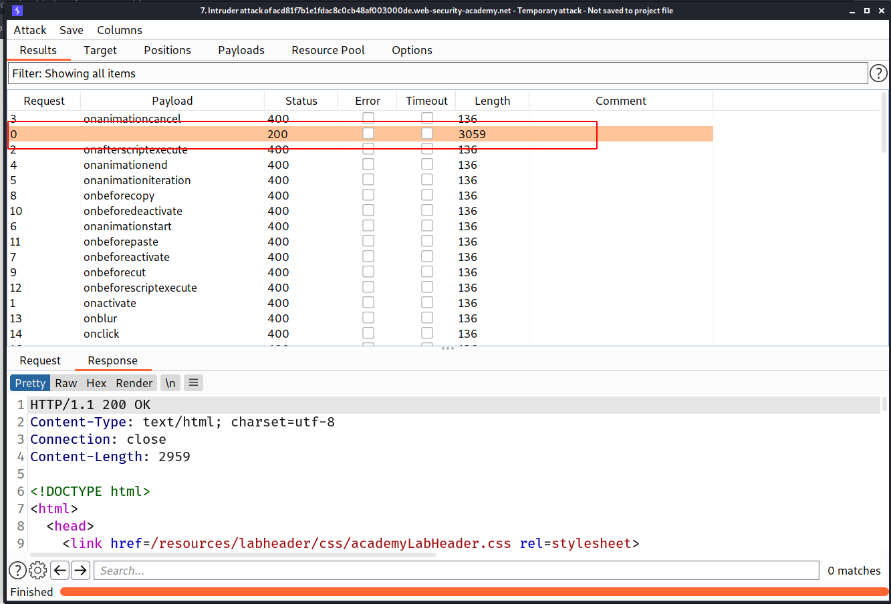
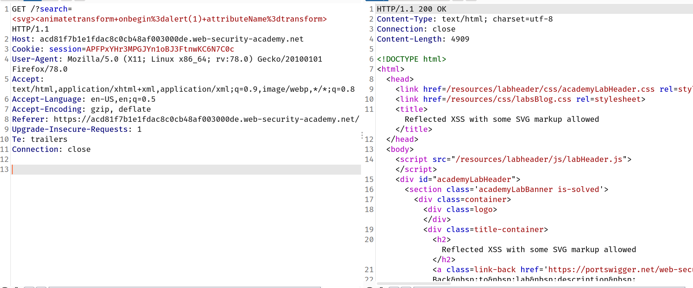

# Lab: Reflected XSS with some SVG markup allowed

> This lab has a simple [reflected XSS](https://portswigger.net/web-security/cross-site-scripting/reflected) vulnerability. The site is blocking common tags but misses some SVG tags and events.
> To solve the lab, perform a [cross-site scripting](https://portswigger.net/web-security/cross-site-scripting) attack that calls the `alert()` function.

--> So i tried all svg related payloads from [This](https://portswigger.net/web-security/cross-site-scripting/cheat-sheet) cheatsheet and one payload worked which was this:

```
<svg><animatetransform+onbegin%3dalert(1)+attributeName%3dtransform>
```



So final payload will look like this:



And after forwarding the request i solved the lab!
