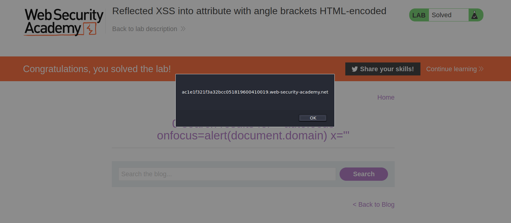
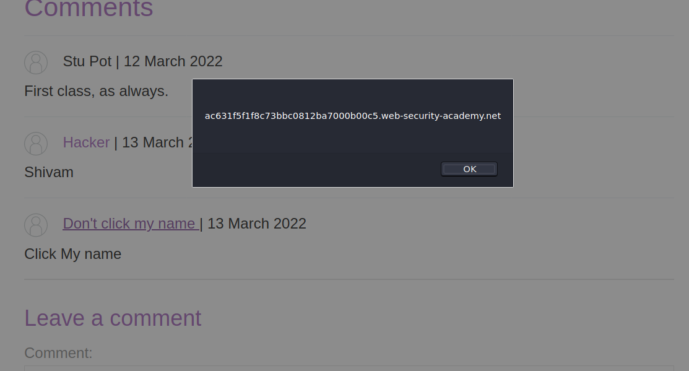
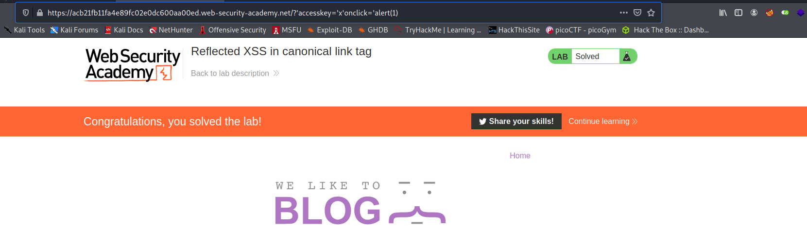

When the XSS context is into an HTML tag attribute value, you might sometimes be able to terminate the attribute value, close the tag, and introduce a new one. For example:

`"><script>alert(document.domain)</script>`

More commonly in this situation, angle brackets are blocked or encoded, so your input cannot break out of the tag in which it appears. Provided you can terminate the attribute value, you can normally introduce a new attribute that creates a scriptable context, such as an event handler. For example:

`" autofocus onfocus=alert(document.domain) x="`

The above payload creates an `onfocus` event that will execute JavaScript when the element receives the focus, and also adds the `autofocus` attribute to try to trigger the `onfocus` event automatically without any user interaction. Finally, it adds `x="` to gracefully repair the following markup.

## Challenge

> This lab contains a [reflected cross-site scripting](https://portswigger.net/web-security/cross-site-scripting/reflected) vulnerability in the search blog functionality where angle brackets are HTML-encoded. To solve this lab, perform a cross-site scripting attack that injects an attribute and calls the `alert` function.

--> So i tried the payload which don't have html tags because they said that it's encoding the angle brackets. So i tried this payload:

```
" autofocus onfocus=alert(document.domain) x="
```

And after forwarding request i solved the lab!



---

Sometimes the XSS context is into a type of HTML tag attribute that itself can create a scriptable context. Here, you can execute JavaScript without needing to terminate the attribute value. For example, if the XSS context is into the `href` attribute of an anchor tag, you can use the `javascript` pseudo-protocol to execute script. For example:

`<a href="javascript:alert(document.domain)">`

## Challenge

> This lab contains a [stored cross-site scripting](https://portswigger.net/web-security/cross-site-scripting/stored) vulnerability in the comment functionality. To solve this lab, submit a comment that calls the `alert` function when the comment author name is clicked.

--> I first tried the basic payloads like `<a href="javascript:alert(document.domain)">` or `<script>alert(1)</script>` with encoding the tags but it didn't worked. And that time i was not putting anything in website and that was the thing which i was doing wrong!

So i entered sample values again but this time i enetered `test.com` in website and after posting comment i found that my username converted into a link which was redirecting me to my website!!

So this means website is putting our website name inside `href` and we can easily alert here using `javascript:alert(document.domain)`.

So i entered above payload in website field. And i solved the lab!



---

You might encounter websites that encode angle brackets but still allow you to inject attributes. Sometimes, these injections are possible even within tags that don't usually fire events automatically, such as a canonical tag. You can exploit this behavior using access keys and user interaction on Chrome. Access keys allow you to provide keyboard shortcuts that reference a specific element. The `accesskey` attribute allows you to define a letter that, when pressed in combination with other keys (these vary across different platforms), will cause events to fire. In the next lab you can experiment with access keys and exploit a canonical tag.

## Challenge

> This lab reflects user input in a canonical link tag and escapes angle brackets.
> To solve the lab, perform a [cross-site scripting](https://portswigger.net/web-security/cross-site-scripting) attack on the home page that injects an attribute that calls the `alert` function.
> To assist with your exploit, you can assume that the simulated user will press the following key combinations:

- `ALT+SHIFT+X`
- `CTRL+ALT+X`
- `Alt+X`

Please note that the intended solution to this lab is only possible in Chrome.

--> I searched about conical tags and i found this definition :

```
A canonical tag (rel=“canonical”) is a snippet of HTML code that defines the main version for duplicate, near-duplicate and similar pages. In other words, if you have the same or similar content available under different URLs, you can use canonical tags to specify which version is the main one and thus, should be indexed.
```

Source: https://ahrefs.com/blog/canonical-tags/

and also we can use canonical tags in website url and using `accesskey` parameter you can trigger an event whenever some specific keys will be pressed. So i used `accesskey` and `onclick` events to trigger an alert.

So i used this payload after the url :

```
/?'accesskey='x'+onclick='alert(1)
--After encoding--
/?%27accesskey=%27x%27onclick=%27alert(1)
```



And i solved the lab!

Reference :

- https://security.stackexchange.com/questions/205975/is-xss-in-canonical-link-possible
- https://www.hackingtruth.in/2020/08/portswigger-reflected-xss-in-canonical.html
