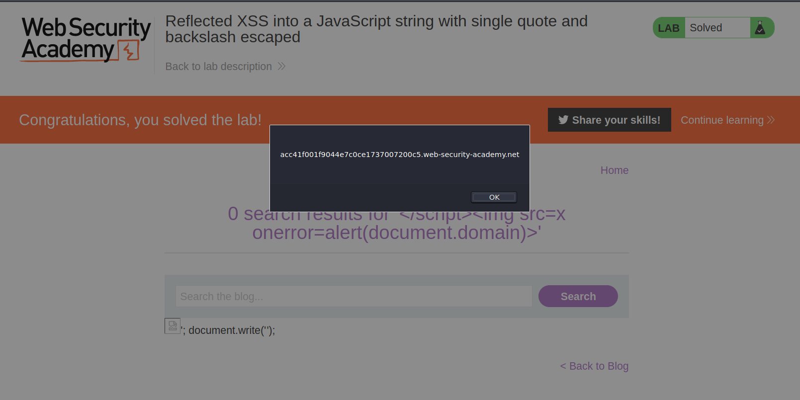
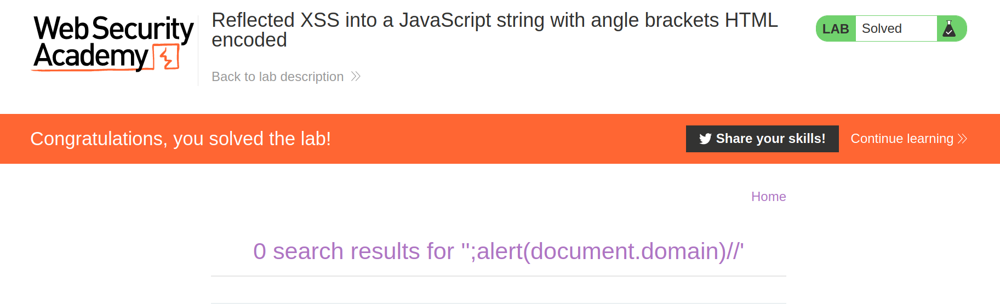
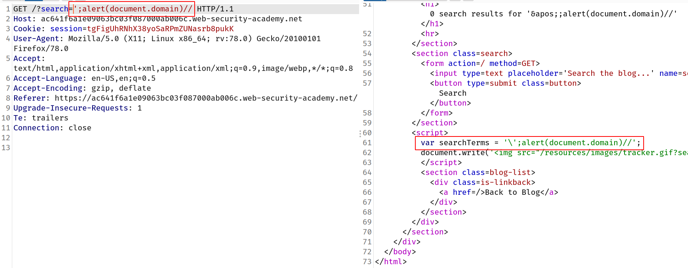
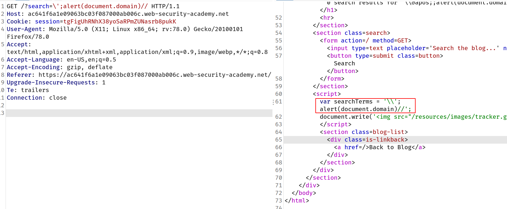

## XSS into JavaScript

When the XSS context is some existing JavaScript within the response, a wide variety of situations can arise, with different techniques necessary to perform a successful exploit.

### Terminating the existing script

In the simplest case, it is possible to simply close the script tag that is enclosing the existing JavaScript, and introduce some new HTML tags that will trigger execution of JavaScript. For example, if the XSS context is as follows:

`<script> ... var input = 'controllable data here'; ... </script>`

then you can use the following payload to break out of the existing JavaScript and execute your own:

`</script>`

The reason this works is that the browser first performs HTML parsing to identify the page elements including blocks of script, and only later performs JavaScript parsing to understand and execute the embedded scripts. The above payload leaves the original script broken, with an unterminated string literal. But that doesn't prevent the subsequent script being parsed and executed in the normal way.

## Lab: Reflected XSS into a JavaScript string with single quote and backslash escaped

> This lab contains a [reflected cross-site scripting](https://portswigger.net/web-security/cross-site-scripting/reflected) vulnerability in the search query tracking functionality. The reflection occurs inside a JavaScript string with single quotes and backslashes escaped.
> To solve this lab, perform a cross-site scripting attack that breaks out of the JavaScript string and calls the `alert` function.

--> First of all i searched for `test` and intercepted request and response. I found that our searchItem was getting stored in variable and then it was encoding it so i tried this payload to break the script tag and enter our own xss payload which will trigger alert.

```
</script>
```

And i solved the lab!



## Breaking out of a JavaScript string

In cases where the XSS context is inside a quoted string literal, it is often possible to break out of the string and execute JavaScript directly. It is essential to repair the script following the XSS context, because any syntax errors there will prevent the whole script from executing.

Some useful ways of breaking out of a string literal are:

```
'-alert(document.domain)-'
';alert(document.domain)//
```

## Lab: Reflected XSS into a JavaScript string with angle brackets HTML encoded

> This lab contains a [reflected cross-site scripting](https://portswigger.net/web-security/cross-site-scripting/reflected) vulnerability in the search query tracking functionality where angle brackets are encoded. The reflection occurs inside a JavaScript string. To solve this lab, perform a cross-site scripting attack that breaks out of the JavaScript string and calls the `alert` function.

--> So first i searched for `hacker` and i got this part of response between `script` tags.

```
<script>
var searchTerms = 'Hacker';
document.write('');
</script>
```

So i used this payload to break the javascript :

```
';alert(document.domain)//
```

And it triggered the alert and we solved the lab!



---

## Bypassing backslash

Some applications attempt to prevent input from breaking out of the JavaScript string by escaping any single quote characters with a backslash. A backslash before a character tells the JavaScript parser that the character should be interpreted literally, and not as a special character such as a string terminator. In this situation, applications often make the mistake of failing to escape the backslash character itself. This means that an attacker can use their own backslash character to neutralize the backslash that is added by the application.

For example, suppose that the input:

`';alert(document.domain)//`

gets converted to:

`\';alert(document.domain)//`

You can now use the alternative payload:

`\';alert(document.domain)//`

which gets converted to:

`\\';alert(document.domain)//`

Here, the first backslash means that the second backslash is interpreted literally, and not as a special character. This means that the quote is now interpreted as a string terminator, and so the attack succeeds.

## Lab: Reflected XSS into a JavaScript string with angle brackets and double quotes HTML-encoded and single quotes escaped

--> First i tried the previous payload which was this :

```
';alert(document.domain)//
```

But the website is inserting backslash `\` before any quote:



So then i tried to insert the payload which contains backslash by default and the backslash from the server will break it and we will be able to trigger alert!

So payload looks like this:

```
\';alert(document.domain)//
```

And as expected, website converted our backslash in `\\` and our alert function went to next line and got executed!



And we solved the lab!

---

Some websites make XSS more difficult by restricting which characters you are allowed to use. This can be on the website level or by deploying a WAF that prevents your requests from ever reaching the website. In these situations, you need to experiment with other ways of calling functions which bypass these security measures. One way of doing this is to use the `throw` statement with an exception handler. This enables you to pass arguments to a function without using parentheses. The following code assigns the `alert()` function to the global exception handler and the `throw` statement passes the `1` to the exception handler (in this case `alert`). The end result is that the `alert()` function is called with `1` as an argument.

`onerror=alert;throw 1`

The next lab demonstrates a website that filters certain characters. You'll have to use similar techniques to those described above in order to solve it.

## Lab: Reflected XSS in a JavaScript URL with some characters blocked

> This lab reflects your input in a JavaScript URL, but all is not as it seems. This initially seems like a trivial challenge; however, the application is blocking some characters in an attempt to prevent [XSS](https://portswigger.net/web-security/cross-site-scripting) attacks.
> To solve the lab, perform a [cross-site scripting](https://portswigger.net/web-security/cross-site-scripting) attack that calls the `alert` function with the string `1337` contained somewhere in the `alert` message.

--> i started by entering differnt payloads in post comment section because there were no search functionality in this website. I tried to get xss in `website` field as some previous labs but it didn't worked :(

So after that i found that we have to inject payload in `postId` parameter. So i found this payload:

```
postId=1&%27},x=x=%3E{throw/**/onerror=alert,1337},toString=x,window%2b%27%27,{x:%27
```

After decode it will be like this:

```
'},x=x=>{throw/**/onerror=alert,1337},toString=x,window+'',{x:'
```

In This payload, we are using exception handling and to make it work, we are using arrow functions here which are denoted with `x = x=> {}` where x have the return value of function. So to display it we are converting it in string using `toString` method and we are overriding the toString method for the object which we will create later in payload and passing it to `x` and to show it on window we are using `window+''` and we are passing the object which we want to convert which is `{x:'`

Reference : https://developer.mozilla.org/en-US/docs/Web/JavaScript/Reference/Global_Objects/Object/toString

And after entering the above payload we solved the lab!
