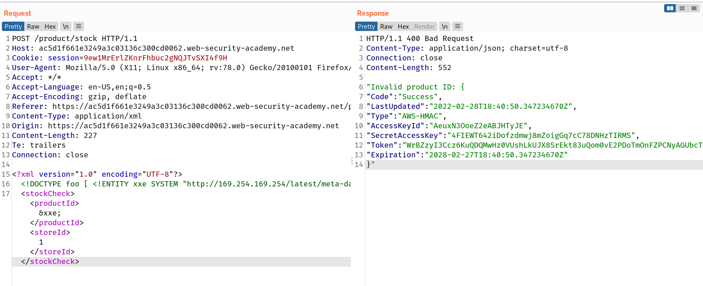

## Exploiting XXE to perform SSRF attacks

Aside from retrieval of sensitive data, the other main impact of XXE attacks is that they can be used to perform server-side request forgery (SSRF). This is a potentially serious vulnerability in which the server-side application can be induced to make HTTP requests to any URL that the server can access.

To exploit an XXE vulnerability to perform an [SSRF attack](https://portswigger.net/web-security/ssrf), you need to define an external XML entity using the URL that you want to target, and use the defined entity within a data value. If you can use the defined entity within a data value that is returned in the application's response, then you will be able to view the response from the URL within the application's response, and so gain two-way interaction with the back-end system. If not, then you will only be able to perform [blind SSRF](https://portswigger.net/web-security/ssrf/blind) attacks (which can still have critical consequences).

In the following XXE example, the external entity will cause the server to make a back-end HTTP request to an internal system within the organization's infrastructure:

`<!DOCTYPE foo [ <!ENTITY xxe SYSTEM "http://internal.vulnerable-website.com/"> ]>`

## challenge

> This lab has a "Check stock" feature that parses XML input and returns any unexpected values in the response.
> The lab server is running a (simulated) EC2 metadata endpoint at the default URL, which is `http://169.254.169.254/`. This endpoint can be used to retrieve data about the instance, some of which might be sensitive.
> To solve the lab, exploit the [XXE](https://portswigger.net/web-security/xxe) vulnerability to perform an [SSRF attack](https://portswigger.net/web-security/ssrf) that obtains the server's IAM secret access key from the EC2 metadata endpoint.

--> So first i tried to add this payload in `check stock` request and changed value of both `productId` and `storeId` to `&xxe;`

```
<!DOCTYPE foo [ <!ENTITY xxe SYSTEM "http://169.254.169.254/"> ]>
```

--> I found this error :

```
"Invalid product ID: latest"
```

--> So i thought it must be some directory and i changed the url with `http://169.254.169.254/latest` and i found another similar error

```
"Invalid product ID: meta-data"
```

--> So after keep doing the above method i found `iam`,`security-credentials`,`admin` directories and i finally found the access tokens and secretAccessKey.



And we solved the lab!
