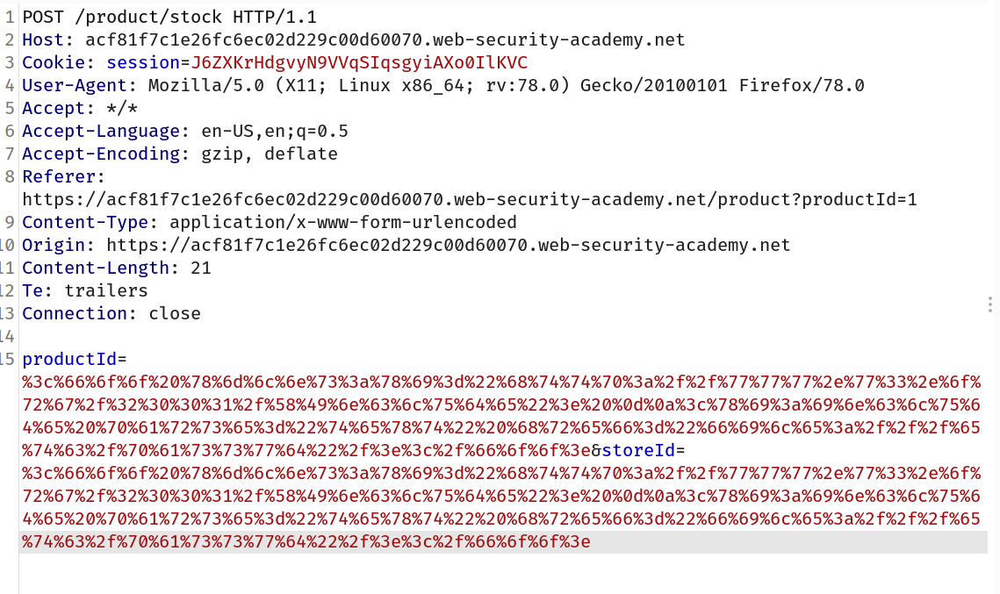
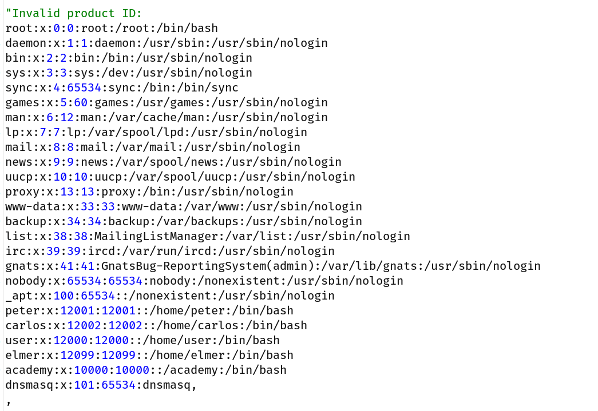

## What are XInclude Attacks?

Some applications receive client-submitted data, embed it on the server-side into an XML document, and then parse the document. An example of this occurs when client-submitted data is placed into a back-end SOAP request, which is then processed by the backend SOAP service.

In this situation, you cannot carry out a classic XXE attack, because you don't control the entire XML document and so cannot define or modify a `DOCTYPE` element. However, you might be able to use `XInclude` instead. `XInclude` is a part of the XML specification that allows an XML document to be built from sub-documents. You can place an `XInclude` attack within any data value in an XML document, so the attack can be performed in situations where you only control a single item of data that is placed into a server-side XML document.

To perform an `XInclude` attack, you need to reference the `XInclude` namespace and provide the path to the file that you wish to include. For example:

```
<foo xmlns:xi="http://www.w3.org/2001/XInclude">
<xi:include parse="text" href="file:///etc/passwd"/></foo>
```

## Challenge

> This lab has a "Check stock" feature that embeds the user input inside a server-side XML document that is subsequently parsed.
> Because you don't control the entire XML document you can't define a DTD to launch a classic [XXE](https://portswigger.net/web-security/xxe) attack.
> To solve the lab, inject an `XInclude` statement to retrieve the contents of the `/etc/passwd` file.

--> so here we can't control XML data so we have to use XInclude which is a part of the XML specification that allows an XML document to be built from sub-documents so i made this payload:

```
<foo xmlns:xi="http://www.w3.org/2001/XInclude">
<xi:include parse="text" href="file:///etc/passwd"/></foo>
```

--> Now goto the main application and intercept the `check stock` request and there are 2 params : `1)productId` and `2)storeId` so i url encoded ALL characters and added the payload in both params.

Final payload will look like this:



After that right click on the request and goto `Do intercept -> response to the request.` and forward the request.

And we got the content of `/etc/passwd` in response!


