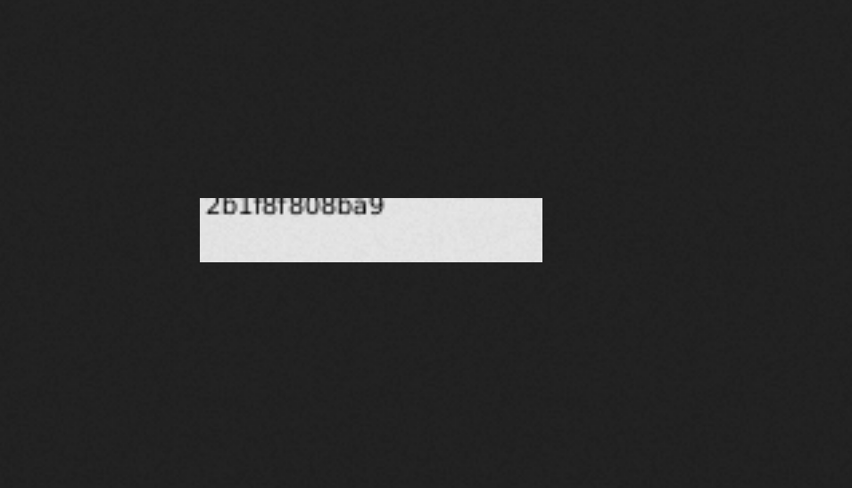

## XXE attacks via file upload

Some applications allow users to upload files which are then processed server-side. Some common file formats use XML or contain XML subcomponents. Examples of XML-based formats are office document formats like DOCX and image formats like SVG.

For example, an application might allow users to upload images, and process or validate these on the server after they are uploaded. Even if the application expects to receive a format like PNG or JPEG, the image processing library that is being used might support SVG images. Since the SVG format uses XML, an attacker can submit a malicious SVG image and so reach hidden attack surface for XXE vulnerabilities.

## Challenge

> This lab lets users attach avatars to comments and uses the Apache Batik library to process avatar image files.
> To solve the lab, upload an image that displays the contents of the `/etc/hostname` file after processing. Then use the "Submit solution" button to submit the value of the server hostname.

--> So i googled for `Apache Batik Svg XXE` and i found one blog which describes it in detail. You can find it [here](https://insinuator.net/2015/03/xxe-injection-in-apache-batik-library-cve-2015-0250/)

So i just made one svg file and added this payload in it:

```
<?xml version="1.0" standalone="yes"?><!DOCTYPE ernw [ <!ENTITY xxe SYSTEM "file:///etc/hostname" > ]><svg width="800px" height="200px" xmlns="http://www.w3.org/2000/svg" xmlns:xlink="http://www.w3.org/1999/xlink" version="1.1"><text font-family="Verdana" font-size="60" x="10" y="40">&xxe;</text></svg>
```

Save this file as `exploit.svg`

--> I have changed `width`,`height` and `font-size` because the output was not visible correctly.

So now goto any blog post and post comment and add `exploit.svg` as avatar image.

After that goto source code and click image link and you will see the output of `/etc/hostname` in image!



And we solved the lab!
